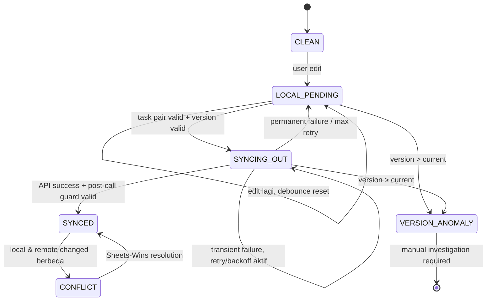

# Architecture Specification v1.0 — SheetViz

## Bagian 2: Sync Architecture (Revisi)

**Baseline:** PRD v1.4 (FROZEN) + Bagian 1 (FINAL & VERIFIED)
**Tanggal:** 9 September 2026
**Status:** Revised Draft untuk Review
**Sifat dokumen:** Aturan deterministik dan pseudocode — bukan implementasi kode.

**Changelog Revisi:** Menutup 2 P0 dan 2 P1 dari review Bagian 2: (1) Celery task kini mengikat `sync_staging_id` **dan** `expected_sync_operation_id` agar debounce benar-benar reset aman; (2) menambahkan **second version guard** setelah Google Sheets API call untuk mencegah sync versi lama menimpa state edit versi baru; (3) menyamakan permanent failure state menjadi `document_rows = LOCAL_PENDING`, bukan `SYNCING_OUT`; (4) memperjelas bahwa fingerprint adalah **content identity**, bukan permanent row identity—`row_id` dipertahankan oleh mapping `_Meta` yang diformalisasikan di Bagian 3.

---

## 2.1 Sync Domain & Terminology

| Istilah | Definisi |
|---|---|
| **Permanent Row Identity** | `row_id` UUID immutable. Ini satu-satunya identitas domain permanen untuk baris. Tidak pernah diturunkan dari konten, fingerprint, atau `row_index`. |
| **Canonical Row Representation** | Tuple terurut nilai kolom berdasarkan `posisi_kolom` saat ini: `(col_1_value, ..., col_n_value)`. Input untuk menghitung fingerprint; **bukan** row identity. |
| **Fingerprint / Content Identity** | Hash dari Canonical Row Representation. Dipakai untuk membandingkan **isi** baris, mendeteksi perubahan konten, dan membantu matching fallback. Fingerprint **bukan** permanent row identity: konten baris yang diedit akan menghasilkan fingerprint baru tetapi mempertahankan `row_id` yang sama. |
| **Row Identity Mapping** | Pemetaan eksplisit `row_id ↔ posisi_baris_saat_ini` yang disimpan di tab `_Meta`. Mapping ini adalah otoritas utama untuk mengenali kembali row saat kontennya berubah; format dan parsing diformalisasikan di Bagian 3. |
| **Anchor Row** | Baris yang fingerprint-nya unik dalam satu dokumen pada suatu waktu. Anchor membantu memvalidasi/persempit matching, tetapi tidak menggantikan row identity mapping. |
| **Duplicate Row** | Dua atau lebih baris dengan fingerprint sama. Tidak dapat dijadikan anchor atau dasar tunggal penentuan identity. |
| **Insertion Event** | Observed row yang tidak punya `row_id` pada mapping `_Meta` yang valid **setelah** proses identity reconciliation; jangan disimpulkan hanya dari fingerprint yang tidak match. |
| **Deletion Event** | `row_id` pada mapping `_Meta` yang tidak punya observed row setelah identity reconciliation. |
| **Shift Event** | `row_id` yang dikenal berpindah `row_index`; identity tetap sama. |
| **Ambiguity Threshold** | Kondisi ketika mapping row tidak bisa direkonsiliasi secara unik/aman. Hasil wajib `SCHEMA_MAPPING_REQUIRED`, bukan tebakan. |
| **Baseline Fingerprint** | `last_synced_fingerprint`: isi pada titik terakhir local dan remote dipastikan selaras. |
| **Local Fingerprint** | Fingerprint dari `row_data` PostgreSQL saat ini. |
| **Remote Fingerprint** | Fingerprint dari observed row di Google Sheets pada polling terakhir. |
| **Matching Window** | Rentang posisi sekitar perubahan untuk membatasi fallback diff; dipakai hanya setelah `_Meta` mapping tidak cukup untuk merekonsiliasi identity. |
| **Sync Operation** | Satu operasi sinkronisasi internal, diidentifikasi `sync_operation_id`, yang merepresentasikan payload dan versi tertentu. |
| **Mutation** | Perubahan atomik (insert/update) pada satu `row_id` yang meningkatkan `mutation_version`. |

**Prinsip terkunci:** `row_id` = identity; fingerprint = content comparison. Tidak ada algoritma diff yang boleh menciptakan atau mengganti `row_id` hanya karena fingerprint berubah.

---

## 2.2 Mutation Transaction

**Aturan wajib:**
1. `mutation_version` increment, pembaruan `row_data`, dan create/replace `sync_staging` dilakukan dalam satu transaksi database.
2. `SELECT ... FOR UPDATE` pada `document_rows.row_id` wajib sebelum menghitung versi baru.
3. Request concurrent pada baris sama menunggu lock selesai; tidak boleh menghasilkan dua increment dari base version yang sama.

```
FUNCTION apply_mutation(row_id, new_row_data, actor_user_id):
    BEGIN TRANSACTION
    row := SELECT * FROM document_rows WHERE row_id = row_id FOR UPDATE

    new_version := row.mutation_version + 1
    new_local_fingerprint := COMPUTE_FINGERPRINT(new_row_data)
    new_operation_id := GENERATE_UUID()

    UPDATE document_rows
    SET row_data = new_row_data,
        mutation_version = new_version,
        local_fingerprint = new_local_fingerprint,
        sync_state = 'LOCAL_PENDING',
        last_sync_error = NULL,
        updated_at = now()
    WHERE row_id = row_id

    CALL enqueue_or_replace_staging_in_transaction(
        row.document_id, row_id, 'update', new_row_data,
        new_version, new_operation_id
    )
    COMMIT

    ENQUEUE_CELERY_TASK_AFTER_COMMIT(
        sync_staging_id,
        expected_sync_operation_id = new_operation_id,
        countdown = 60 seconds
    )
    RETURN new_operation_id
END FUNCTION
```

Catatan: `ENQUEUE_CELERY_TASK_AFTER_COMMIT` harus dilakukan setelah commit sukses agar task tidak membaca state DB yang belum committed. Jika publish task gagal setelah commit, scheduled sweeper Celery (lihat 2.4) menemukan staging `queued` yang jatuh tempo dan menjadwalkannya kembali.

---

## 2.3 Mutation Version Algorithm

**Invariant:** `mutation_version BIGINT` monotonik per `row_id`; tidak pernah menurun atau reset.

```
FUNCTION evaluate_job_version(job_version, current_version):
    IF job_version == current_version: RETURN VALID
    IF job_version < current_version:  RETURN STALE
    RETURN VERSION_ANOMALY  -- job_version > current_version
END FUNCTION
```

- `VALID`: job mewakili versi saat ini.
- `STALE`: job usang; drop, jangan retry.
- `VERSION_ANOMALY`: kondisi bug/korupsi; stop otomatis dan eskalasi.

---

## 2.4 Sync Staging & Debounce (P0 Fix)

**Masalah yang ditutup:** Task lama tidak boleh dapat mengeksekusi payload baru terlalu cepat ketika row `sync_staging` yang sama di-update/reset oleh edit berikutnya.

**Kontrak task Celery wajib:** setiap task membawa dua parameter:

```
(sync_staging_id, expected_sync_operation_id)
```

**Pseudocode penggantian job (berjalan di dalam Mutation Transaction):**

```
FUNCTION enqueue_or_replace_staging_in_transaction(
    document_id, row_id, operation, payload, version, new_operation_id
):
    existing_job := SELECT * FROM sync_staging
                    WHERE row_id = row_id AND sync_state = 'queued'
                    ORDER BY created_at DESC LIMIT 1
                    FOR UPDATE

    IF existing_job EXISTS:
        UPDATE sync_staging
        SET payload = payload,
            job_mutation_version = version,
            sync_operation_id = new_operation_id,
            scheduled_at = now() + 60 seconds,
            attempt_count = 0
        WHERE id = existing_job.id
        RETURN existing_job.id
    ELSE:
        INSERT INTO sync_staging (...)
        VALUES (..., version, new_operation_id, 'queued', now() + 60 seconds)
        RETURN new_staging_id
END FUNCTION
```

**Worker precondition (wajib dilakukan sebelum version guard):**

```
job := SELECT * FROM sync_staging WHERE id = task.sync_staging_id

IF job DOES NOT EXIST OR job.sync_state != 'queued':
    RETURN TASK_NOOP

IF job.sync_operation_id != task.expected_sync_operation_id:
    RETURN TASK_SUPERSEDED  -- task lama, payload/versi sudah diganti; tidak boleh eksekusi
```

**Contoh timeline yang kini aman:**
- t=0: edit versi 1 → staging `X`, operation `op-1`, task `(X, op-1)` dijadwalkan t+60.
- t=10: edit versi 2 → staging `X` diubah ke operation `op-2`, due time t+70, task `(X, op-2)` dijadwalkan.
- t=60: task `(X, op-1)` bangun → database membaca `op-2` ≠ `op-1` → `TASK_SUPERSEDED`, berhenti tanpa menulis.
- t=70: task `(X, op-2)` bangun → operation ID cocok → lanjut version guard.

**Fallback scheduler:** Celery Beat menjalankan sweeper setiap 30–60 detik untuk mencari `sync_staging` dengan `sync_state='queued' AND scheduled_at <= now()`. Sweeper menjadwalkan task dengan pair `(id, sync_operation_id)`. Ini menutup kegagalan publish task tepat setelah transaction commit dan tidak melanggar debounce karena hanya job yang sudah jatuh tempo yang dipublish.

---

## 2.5 Worker Version Guard (P0 Fix: Guard Sebelum dan Sesudah External Boundary)

Google Sheets API adalah external side-effect di luar transaksi PostgreSQL, sehingga worker membutuhkan **dua version guard boundary**:

1. **Pre-call guard:** sebelum write ke Google, pastikan operation ID dan version masih valid.
2. **Post-call guard:** setelah response Google diterima, lock ulang row dan pastikan tidak ada mutation lebih baru sebelum state DB ditandai `SYNCED`.

```
FUNCTION worker_execute_sync_task(staging_id, expected_operation_id):
    BEGIN TRANSACTION
    job := SELECT * FROM sync_staging WHERE id = staging_id FOR UPDATE

    IF job missing OR job.sync_state != 'queued':
        ROLLBACK; RETURN TASK_NOOP
    IF job.sync_operation_id != expected_operation_id:
        ROLLBACK; RETURN TASK_SUPERSEDED

    row := SELECT * FROM document_rows WHERE row_id = job.row_id FOR UPDATE
    decision := evaluate_job_version(job.job_mutation_version, row.mutation_version)

    IF decision == STALE:
        UPDATE sync_staging SET sync_state = 'stale_dropped' WHERE id = staging_id
        COMMIT; LOG_EVENT('stale_job_dropped'); RETURN

    IF decision == VERSION_ANOMALY:
        UPDATE sync_staging SET sync_state = 'anomaly' WHERE id = staging_id
        UPDATE document_rows SET sync_state = 'VERSION_ANOMALY' WHERE row_id = job.row_id
        COMMIT; ESCALATE; RETURN

    UPDATE sync_staging SET sync_state = 'syncing' WHERE id = staging_id
    UPDATE document_rows SET sync_state = 'SYNCING_OUT' WHERE row_id = job.row_id
    COMMIT

    result := CALL_GOOGLE_SHEETS_API_IDEMPOTENT(job)  -- lihat 2.11

    IF result == SUCCESS:
        BEGIN TRANSACTION
        current_row := SELECT * FROM document_rows WHERE row_id = job.row_id FOR UPDATE
        current_job := SELECT * FROM sync_staging WHERE id = staging_id FOR UPDATE

        -- SECOND VERSION GUARD: external API call bukan atomic dengan DB.
        IF current_row.mutation_version != job.job_mutation_version
           OR current_job.sync_operation_id != expected_operation_id:
            -- Google menerima versi lama, tetapi DB sudah punya edit lebih baru.
            -- Jangan overwrite state/data versi baru menjadi SYNCED.
            UPDATE sync_staging SET sync_state = 'synced' WHERE id = staging_id
            -- current_row dibiarkan apa adanya (biasanya LOCAL_PENDING versi baru).
            COMMIT
            LOG_EVENT('external_write_succeeded_but_newer_local_version_exists')
            RETURN

        UPDATE document_rows
        SET sync_state = 'SYNCED',
            last_synced_fingerprint = result.remote_fingerprint,
            remote_fingerprint = result.remote_fingerprint,
            local_fingerprint = result.remote_fingerprint,
            last_synced_at = now(),
            last_sync_error = NULL
        WHERE row_id = job.row_id
        UPDATE sync_staging SET sync_state = 'synced' WHERE id = staging_id
        COMMIT
        RETURN

    CALL handle_sync_failure(job, result)  -- lihat 2.11
END FUNCTION
```

**Catatan P0:** Jika post-call guard menemukan versi baru, write versi lama mungkin memang sudah tersimpan di Google Sheets, tetapi itu tidak menghapus edit lokal versi baru dari PostgreSQL. Job versi baru yang sudah `LOCAL_PENDING` akan tetap berjalan dan menulis versi terbaru setelah debounce. Dashboard cache tidak boleh ditandai `SYNCED` secara salah.

---

## 2.6 Row Identity & Row Matching (Revisi Peran Fingerprint)

**Prinsip koreksi:** observed row tidak boleh memperoleh `row_id` semata-mata dari kecocokan fingerprint. Fingerprint dapat berubah ketika konten baris diedit; perubahan isi harus tetap mengarah ke `row_id` yang sama agar Three-Fingerprint Conflict Matrix dapat bekerja.

**Hierarki sumber identity saat polling:**

1. **Otoritas utama: `_Meta` row mapping** — mapping eksplisit `row_id ↔ posisi_baris_saat_ini`; jika tersedia dan struktur tidak ambigu, observed row pada posisi yang dipetakan diasosiasikan ke `row_id` tersebut **meski fingerprint berubah**.
2. **Validasi/anchor content** — fingerprint unik membantu memvalidasi bahwa mapping posisi masih masuk akal dan mempersempit area perubahan.
3. **LCS/Myers fallback** — digunakan hanya ketika mapping posisi perlu direkonsiliasi akibat insert/shift, untuk menyelaraskan sequence; hasilnya adalah **kandidat mapping**, bukan otoritas final identity jika fingerprint berubah.
4. **Ambiguity fallback** — jika identity tidak bisa dibuktikan unik, `SCHEMA_MAPPING_REQUIRED`; jangan treat fingerprint berbeda otomatis sebagai deletion + insertion.

**Konsekuensi:**
- User mengubah `Budi | 100000` menjadi `Budi | 150000` di Sheets pada posisi yang sama: `_Meta` mempertahankan `row_id` Budi, `remote_fingerprint` berubah, lalu conflict matrix (2.9) memutuskan `PULL_REMOTE` atau `CONFLICT`.
- Hasil LCS hanya boleh mengklasifikasikan baris sebagai insertion/deletion setelah `_Meta` mapping dan aturan ambiguitas dievaluasi; fingerprint mismatch sendiri tidak cukup.

---

## 2.7 LCS/Myers Diff Algorithm

LCS/Myers tetap dipakai sebagai mekanisme sequence alignment untuk kasus insertion/shift, bukan sebagai pembuat permanent identity.

**Input:**
- Known sequence: `(row_id, last_known_index, baseline_fingerprint)` dari cache + `_Meta`.
- Observed sequence: `(observed_index, observed_fingerprint)` dari Raw Data.
- Anchor row unik dipetakan/diikat lebih dulu sebagai boundary segment.

**Peran LCS:** menghasilkan candidate alignment terhadap segmen di antara anchor row. Pemetaan candidate baru dianggap valid jika konsisten dengan `_Meta` dan tidak memicu ambiguity rules (2.8).

```
FUNCTION align_sequences_with_lcs(known_segment, observed_segment):
    -- token utama = fingerprint untuk baris tidak berubah;
    -- mapping _Meta/posisi dipakai sebagai constraint tambahan,
    -- bukan fingerprint saja.
    dp := LCS_DYNAMIC_PROGRAMMING(known_segment.fingerprint_tokens,
                                  observed_segment.fingerprint_tokens)
    candidate_pairs := BACKTRACK(dp)
    RETURN candidate_pairs
END FUNCTION
```

**Batas peran:** Jika baris berubah konten (fingerprint baru), LCS mungkin tidak memasangkannya. Sistem **tidak boleh** langsung menyimpulkan row lama deleted dan row baru inserted; sistem kembali ke `_Meta`/positional continuity atau menandai ambiguity. Detail format `_Meta` yang membuat positional continuity dapat diverifikasi ada di Bagian 3.

**Kompleksitas:** LCS klasik O(n×m); hanya diterapkan pada matching window/segmen non-anchor. Untuk dokumen hingga 10.000 row, full comparison fingerprint boleh dilakukan ketika `revisionId` berubah, tetapi LCS penuh seluruh dokumen tidak boleh menjadi jalur normal.

---

## 2.8 Ambiguity Detection

`SCHEMA_MAPPING_REQUIRED` dipicu jika salah satu kondisi ini terjadi:

1. Duplicate fingerprint menciptakan lebih dari satu pasangan identity yang sama-sama valid dalam segmen matching.
2. Multiple LCS alignment optimal menghasilkan pemetaan `row_id` berbeda.
3. Perubahan struktur (insert/delete/reorder) melanggar continuity mapping `_Meta` dan tidak dapat direkonsiliasi unik.
4. Rasio candidate insertion/deletion melebihi parameter awal 30% total baris per polling cycle (kalibrasi Fase 2).
5. `_Meta` hilang/rusak/tidak konsisten dengan Raw Data.

```
FUNCTION handle_ambiguity(document_id, context):
    UPDATE documents
    SET meta_mapping_status = 'SCHEMA_MAPPING_REQUIRED',
        sync_status = 'conflict_detected'
    WHERE id = document_id

    PAUSE_AUTOMATED_SYNC_FOR_DOCUMENT(document_id)
    LOG_EVENT('row_mapping_ambiguity', context)
    NOTIFY_USER_IN_APP(document_id, 'Konfirmasi pemetaan data diperlukan')
END FUNCTION
```

---

## 2.9 Three-Fingerprint Conflict Matrix

Hanya dijalankan setelah observed row berhasil diasosiasikan ke `row_id` melalui hierarchy 2.6.

| Baseline vs Local | Baseline vs Remote | Local vs Remote | Keputusan | Aksi |
|---|---|---|---|---|
| Sama | Sama | Sama | Tidak ada perubahan | `NO_ACTION` |
| Berbeda | Sama | Berbeda | Hanya local berubah | `PUSH_LOCAL` |
| Sama | Berbeda | Berbeda | Hanya remote berubah | `PULL_REMOTE` |
| Berbeda | Berbeda | Sama | Konvergen | `NO_ACTION_CONVERGED`, baseline diperbarui |
| Berbeda | Berbeda | Berbeda | Konflik | `CONFLICT` → 2.10 |

```
FUNCTION evaluate_conflict(baseline_fp, local_fp, remote_fp):
    local_changed := (baseline_fp != local_fp)
    remote_changed := (baseline_fp != remote_fp)

    IF NOT local_changed AND NOT remote_changed: RETURN NO_ACTION
    IF local_changed AND NOT remote_changed: RETURN PUSH_LOCAL
    IF NOT local_changed AND remote_changed: RETURN PULL_REMOTE
    IF local_fp == remote_fp: RETURN NO_ACTION_CONVERGED
    RETURN CONFLICT
END FUNCTION
```

---

## 2.10 Sheets-Wins Conflict Resolution

```
FUNCTION resolve_conflict_sheets_wins(row_id, remote_fingerprint, remote_row_data):
    BEGIN TRANSACTION
    row := SELECT * FROM document_rows WHERE row_id = row_id FOR UPDATE

    UPDATE sync_staging
    SET sync_state = 'stale_dropped'
    WHERE row_id = row_id AND sync_state = 'queued'

    UPDATE document_rows
    SET row_data = remote_row_data,
        last_synced_fingerprint = remote_fingerprint,
        local_fingerprint = remote_fingerprint,
        remote_fingerprint = remote_fingerprint,
        sync_state = 'SYNCED',
        mutation_version = mutation_version + 1,
        last_synced_at = now(),
        last_sync_error = NULL
    WHERE row_id = row_id

    LOG_EVENT('conflict_resolved_sheets_wins', row_id)
    COMMIT
    NOTIFY_USER_IN_APP(row_id, 'Perubahan aplikasi digantikan versi terbaru Google Sheets')
END FUNCTION
```

`mutation_version` tetap meningkat agar seluruh job sebelumnya otomatis stale; tidak pernah reset.

---

## 2.11 External Idempotency & Retry (Failure State Fix)

`sync_operation_id` adalah identity internal unik. Google Sheets API tidak menyediakan idempotency key generik untuk `batchUpdate`, maka retry memakai **read-before-write verification**.

```
FUNCTION call_google_sheets_api_idempotent(job):
    IF job.attempt_count > 0:
        remote := READ_TARGET_ROW_FROM_SHEETS(job.document_id, job.row_id)
        IF COMPUTE_FINGERPRINT(remote) == COMPUTE_FINGERPRINT(job.payload):
            RETURN SUCCESS_ALREADY_APPLIED

    result := GOOGLE_SHEETS_BATCH_UPDATE(job.document_id, job.payload)
    IF result.success: RETURN SUCCESS
    IF result.network_timeout OR result.transient_error: RETURN RETRY_NEEDED
    RETURN PERMANENT_FAILURE
END FUNCTION

FUNCTION handle_sync_failure(job, result):
    IF result == RETRY_NEEDED AND job.attempt_count < 4:
        UPDATE sync_staging
        SET sync_state = 'queued', attempt_count = attempt_count + 1,
            scheduled_at = now() + BACKOFF(attempt_count)
        WHERE id = job.id
        -- row tetap SYNCING_OUT selama retry aktif
        ENQUEUE_TASK(job.id, job.sync_operation_id, BACKOFF(...))
        RETURN

    -- Permanent failure / retries exhausted: state disamakan secara semantik.
    BEGIN TRANSACTION
    UPDATE sync_staging SET sync_state = 'failed' WHERE id = job.id
    UPDATE document_rows
    SET sync_state = 'LOCAL_PENDING',
        last_sync_error = result.error_message
    WHERE row_id = job.row_id
    COMMIT
    NOTIFY_USER_IN_APP(job.row_id, 'Sinkronisasi gagal. Coba ulang secara manual.')
END FUNCTION
```

**Kebijakan backoff:** retry ke-2: 5 detik; ke-3: 15 detik; ke-4: 45 detik; maksimum 4 percobaan. Setelah gagal permanen, row menjadi `LOCAL_PENDING` karena perubahan lokal masih ada dan belum tersinkron—bukan `SYNCING_OUT`.

---

## 2.12 Failure / Recovery State Machine (Diselaraskan)



`SCHEMA_MAPPING_REQUIRED` adalah dokumen-state yang mem-pause seluruh sync otomatis sampai mapping dikonfirmasi manual; ia bukan row-state.

---

## 2.13 End-to-End Sync Sequence (Revisi Second Guard)

```mermaid
sequenceDiagram
    participant U as User
    participant API as FastAPI
    participant DB as PostgreSQL
    participant CW as Celery Worker
    participant GS as Google Sheets

    U->>API: Edit row (row_id, data baru)
    API->>DB: BEGIN; row lock; version+1; replace/create staging (op-id baru); COMMIT
    API-->>U: 202 Accepted (sync_operation_id)
    API->>CW: Schedule task(staging_id, expected_operation_id, +60s)

    Note over CW,DB: Pre-call guard
    CW->>DB: Lock job; compare expected_operation_id; lock row; compare version
    alt task superseded / stale / anomaly
        CW->>DB: no-op / stale_dropped / anomaly
    else valid
        CW->>DB: job=syncing; row=SYNCING_OUT; COMMIT
        CW->>GS: write / retry verification
        GS-->>CW: success

        Note over CW,DB: Post-call guard (external boundary)
        CW->>DB: Lock row + job; verify current_version == job_version AND op-id matches
        alt newer mutation exists
            CW->>DB: job=synced; preserve row newer state (LOCAL_PENDING)
        else still current
            CW->>DB: row=SYNCED; update 3 fingerprints; job=synced
        end
    end

    Note over CW,GS: Polling flow uses _Meta identity first, then fingerprint conflict matrix
```

---

## Validasi Silang

- ✅ Debounce aman: Celery task mengikat `staging_id + expected_sync_operation_id`; task lama menjadi `TASK_SUPERSEDED`.
- ✅ Dua version guard: sebelum dan sesudah Google API boundary.
- ✅ Permanent failure konsisten: job `failed`, row `LOCAL_PENDING` + `last_sync_error`.
- ✅ Fingerprint didefinisikan sebagai content identity, bukan row identity; `_Meta` adalah otoritas persistence identity.
- ✅ LCS/Myers dibatasi sebagai fallback sequence alignment, bukan pencipta `row_id`.
- ✅ Seluruh mekanisme tetap architecture specification/pseudocode, tanpa implementasi Python.

---

**Status Bagian 2:** Revised Draft siap review. Setelah disetujui, lanjut ke **Bagian 3: Google Sheets Mapping** untuk memformalkan `_Meta` schema, row/column identity persistence, parsing, dan reconciliation rules.
