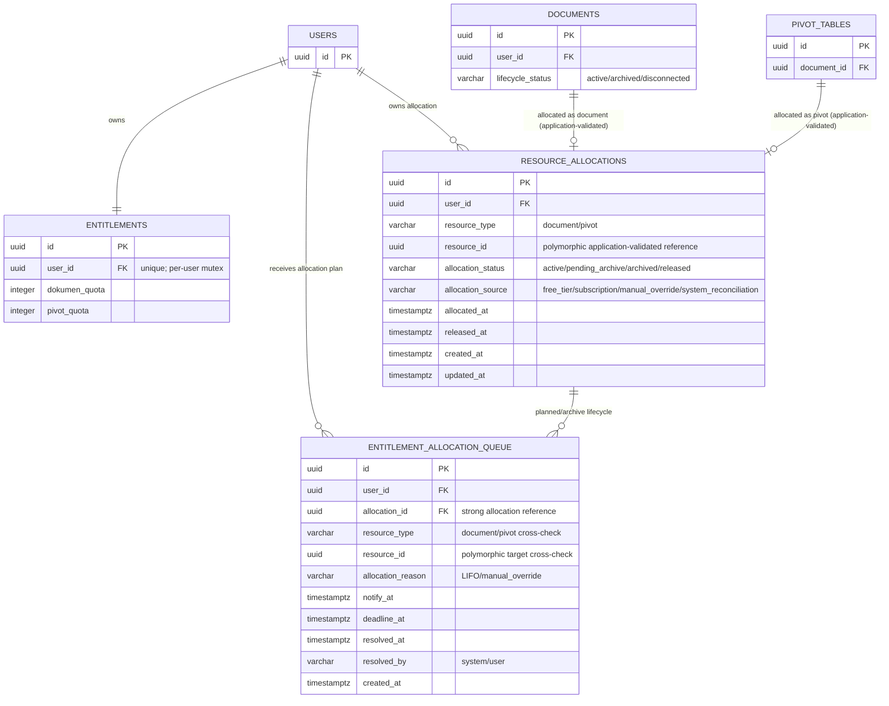
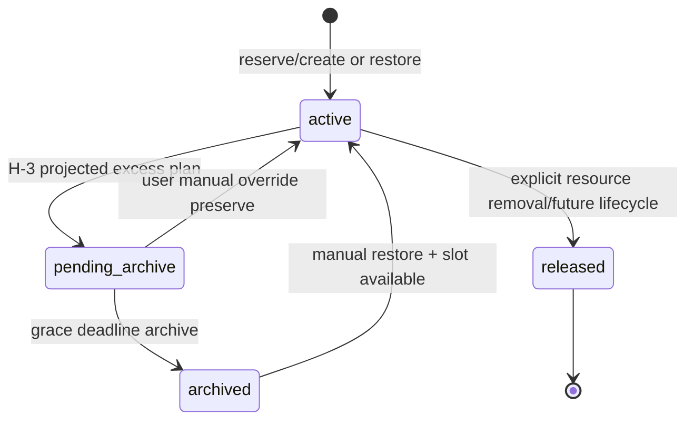

# Architecture Specification v1.0 — SheetViz

## Controlled Revision: Bagian 1 — System Architecture + Database ERD

**Baseline yang direvisi:** Bagian 1 v2 (FINAL & VERIFIED)
**Pemicu revisi:** Bagian 5 — Entitlement Rules Engine v2 (FINAL / APPROVED)
**Tanggal:** 9 September 2026
**Versi controlled revision:** v3.1
**Status:** Draft untuk Final Verification
**Scope revisi:** Terbatas pada penambahan `resource_allocations` dan generalisasi `entitlement_allocation_queue` untuk mendukung allocation dokumen dan pivot. Tidak ada redesign sync/data identity, `_Meta`, atau domain lain.

---

## CR-1. Ringkasan Controlled Changes

| ID | Perubahan | Alasan | Dampak |
|---|---|---|---|
| CR-1A | Tambah tabel `resource_allocations` | Bagian 5 menetapkan allocation sebagai konsep terpisah dari entitlement dan usage; perlu source of truth untuk slot resource aktif | Mendukung atomic reserve/create/restore/archive dan enforcement quota document/pivot |
| CR-1B | Generalisasi `entitlement_allocation_queue` | Queue lama hanya punya `target_document_id`; Bagian 5 mewajibkan allocation plan berlaku untuk document **dan** pivot | Ganti FK `target_document_id` dengan pasangan polymorphic `resource_type + resource_id` |
| CR-1C | Tambah index enforcement/reconciliation | Bagian 5 mengunci query path: lock entitlement lalu count allocation active/pending serta proses candidate LIFO | Index pada `(user_id, resource_type, allocation_status, allocated_at, resource_id)` dan deadline queue |
| CR-1D | Tambah integrity rules application-level | PostgreSQL tidak mendukung native FK polymorphic ke dua tabel sekaligus | Validasi ownership/keberadaan resource di service layer; reconciliation job mendeteksi mismatch |
| CR-1E | Perketat hard precondition backfill migration | Audit saja tidak cukup bila ada legacy queue yang orphan/ambiguous | Migration wajib abort sebelum NOT NULL/FK/drop legacy jika mapping tidak 100% sukses dan unambiguous |

---

## CR-2. Yang Tidak Berubah

Controlled revision ini **tidak mengubah** keputusan final berikut dari Bagian 1 v2:

- **System architecture:** FastAPI + Celery + Redis + PostgreSQL, Cloudflare, Google OAuth/Sheets/Drive, Tripay/Midtrans.
- **Canonical source:** Google Sheets adalah canonical source untuk data user; PostgreSQL adalah materialized cache data dan source application state.
- **Row identity:** `document_rows.row_id` tetap UUID immutable Primary Key; `row_index` tetap mutable dan bukan identity.
- **Column identity:** `document_columns.column_id` tetap UUID immutable Primary Key; `posisi_kolom` tetap mutable dan bukan identity.
- **Fingerprint model:** `last_synced_fingerprint`, `local_fingerprint`, `remote_fingerprint` tetap terpisah.
- **Version guard:** `mutation_version BIGINT`, guard `==`/`<`/`>` tetap berlaku.
- **State separation:** `document_rows.sync_state` dan `sync_staging.sync_state` tetap terpisah; `stale_dropped` hanya job-state.
- **Sync pairing:** `sync_staging_id + expected_sync_operation_id` tetap pair guard immutable.
- **`_Meta`:** layout/mapping/checksum/operational integrity tetap ditentukan Bagian 3 dan tidak diubah.
- **API/general security:** tidak diubah dalam revisi ERD ini.

---

## CR-3. ERD Tambahan dan Relasi Berubah



**Catatan Mermaid:** hubungan `DOCUMENTS/PIVOT_TABLES → RESOURCE_ALLOCATIONS` diberi label application-validated karena PostgreSQL tidak menyediakan polymorphic foreign key native. FK database tetap tersedia ke `users` dan `resource_allocations` dari queue.

---

## CR-4. Tabel Baru: `resource_allocations`

### CR-4.1 Fungsi

`resource_allocations` adalah source of truth untuk **slot entitlement yang telah dialokasikan**. Ia berbeda dari:

- `entitlements`: kapasitas maksimal efektif user.
- `documents`/`pivot_tables`: resource aktual milik user.
- `resource_allocations`: hubungan eksplisit "resource ini saat ini mengonsumsi/menahan slot quota".

Tabel ini wajib dipakai oleh seluruh path create, restore, archive, dan allocation planning. Ia mencegah race condition quota dengan pola Bagian 5: `lock entitlement → count allocated → reserve/create → commit`.

### CR-4.2 DDL

```sql
-- CR-1A: Tabel allocation baru, dibuat setelah documents dan pivot_tables
CREATE TABLE resource_allocations (
    id UUID PRIMARY KEY DEFAULT gen_random_uuid(),
    user_id UUID NOT NULL REFERENCES users(id) ON DELETE CASCADE,

    -- Polymorphic resource reference: validasi FK dilakukan service layer
    resource_type VARCHAR(20) NOT NULL
        CHECK (resource_type IN ('document', 'pivot')),
    resource_id UUID NOT NULL,

    allocation_status VARCHAR(20) NOT NULL DEFAULT 'active'
        CHECK (allocation_status IN ('active', 'pending_archive', 'archived', 'released')),
    allocation_source VARCHAR(30) NOT NULL
        CHECK (allocation_source IN (
            'free_tier', 'subscription', 'manual_override', 'system_reconciliation'
        )),

    allocated_at TIMESTAMPTZ NOT NULL DEFAULT now(),
    released_at TIMESTAMPTZ,
    created_at TIMESTAMPTZ NOT NULL DEFAULT now(),
    updated_at TIMESTAMPTZ NOT NULL DEFAULT now(),

    -- Satu resource maksimum memiliki satu allocation record sepanjang lifecycle.
    UNIQUE (resource_type, resource_id),

    -- Released/archive timestamp tidak boleh sebelum allocation dibuat.
    CHECK (released_at IS NULL OR released_at >= allocated_at)
);

-- Enforced query path Bagian 5:
-- WHERE user_id=? AND resource_type=?
--   AND allocation_status IN ('active','pending_archive')
-- ORDER BY allocated_at ASC, resource_id ASC
CREATE INDEX idx_resource_allocations_enforcement
    ON resource_allocations (
        user_id,
        resource_type,
        allocation_status,
        allocated_at ASC,
        resource_id ASC
    );

-- Reconciliation/finding resource by application type/id.
CREATE INDEX idx_resource_allocations_resource
    ON resource_allocations (resource_type, resource_id);

-- Partial index untuk allocation yang menahan slot efektif; optional but useful
-- when archived/released history grows.
CREATE INDEX idx_resource_allocations_active_slot
    ON resource_allocations (user_id, resource_type, allocated_at ASC, resource_id ASC)
    WHERE allocation_status IN ('active', 'pending_archive');
```

### CR-4.3 Lifecycle Allocation



| Status | Mengonsumsi slot? | Resource access | Makna |
|---|---:|---|---|
| `active` | Ya | Normal | Allocation aktif |
| `pending_archive` | Ya | Normal selama grace | Kandidat archive hasil H-3 projected plan |
| `archived` | Tidak | Read-only/terkunci sesuai resource | Melebihi entitlement setelah deadline |
| `released` | Tidak | Resource tidak lagi dialokasikan | Resource dihapus/disconnect/lifecycle future |

**Invariant Bagian 5:** `allocated_count = COUNT(status IN ('active', 'pending_archive'))`. Archive/released tidak dihitung sebagai slot.

### CR-4.4 Ownership & Integrity Enforcement

Karena reference polymorphic tidak bisa mendapat FK native, service layer **wajib** memenuhi aturan berikut sebelum membuat/mengubah allocation:

| `resource_type` | Verifikasi wajib |
|---|---|
| `document` | `documents.id = resource_id` ada, `documents.user_id = allocation.user_id`, lifecycle sesuai aksi |
| `pivot` | `pivot_tables.id = resource_id` ada, pivot terhubung ke `documents`, lalu `documents.user_id = allocation.user_id` |

Pelanggaran ownership/jenis resource adalah `VERSION_ANOMALY` internal atau `RESOURCE_NOT_FOUND` pada API user-facing (untuk menghindari data leakage). Job reconciliation Bagian 5.7 memeriksa ownership allocation harian dan membuat audit alert jika mismatch terdeteksi.

---

## CR-5. Generalisasi `entitlement_allocation_queue`

### CR-5.1 Perubahan Konsep

**Sebelum (Bagian 1 v2):** queue hanya mendukung `target_document_id` sehingga tidak dapat merepresentasikan plan archive untuk pivot.

**Sesudah (controlled revision):** queue mereferensikan allocation record (`allocation_id`) dan menyimpan `resource_type + resource_id` sebagai snapshot/cross-check. Dengan ini satu queue dapat menangani document dan pivot secara generic.

### CR-5.2 DDL Migration Strategy dan Hard Safety Gate

```sql
-- CR-1B: Tambahkan kolom generic terlebih dahulu
ALTER TABLE entitlement_allocation_queue
    ADD COLUMN allocation_id UUID,
    ADD COLUMN resource_type VARCHAR(20),
    ADD COLUMN resource_id UUID;

-- Backfill queue lama yang target_document_id-nya ada.
-- allocation_id diisi melalui resource_allocations untuk resource_type='document'.
UPDATE entitlement_allocation_queue q
SET resource_type = 'document',
    resource_id = q.target_document_id,
    allocation_id = ra.id
FROM resource_allocations ra
WHERE q.target_document_id = ra.resource_id
  AND ra.resource_type = 'document';
```

### Hard precondition — wajib lulus sebelum constraint atau drop legacy

**Backfill success criterion:** **100%** legacy row pada `entitlement_allocation_queue` harus terpetakan secara **unambiguous ke tepat satu** baris `resource_allocations` dengan `resource_type = 'document'` dan `resource_id = target_document_id`.

Migration wajib menjalankan audit gate berikut setelah backfill dan **sebelum** `NOT NULL`, FK, CHECK, atau `DROP COLUMN target_document_id`:

```sql
-- Gate A: Tidak boleh ada orphan/NULL mapping.
SELECT q.id, q.user_id, q.target_document_id
FROM entitlement_allocation_queue q
WHERE q.allocation_id IS NULL
   OR q.resource_type IS NULL
   OR q.resource_id IS NULL;

-- Gate B: Semua generic field harus identik dengan legacy target.
SELECT q.id, q.user_id, q.target_document_id,
       q.resource_type, q.resource_id, ra.id AS allocation_id,
       ra.user_id AS allocation_user_id, ra.resource_type AS allocation_resource_type,
       ra.resource_id AS allocation_resource_id
FROM entitlement_allocation_queue q
LEFT JOIN resource_allocations ra ON ra.id = q.allocation_id
WHERE q.resource_type <> 'document'
   OR q.resource_id <> q.target_document_id
   OR ra.id IS NULL
   OR ra.user_id <> q.user_id
   OR ra.resource_type <> 'document'
   OR ra.resource_id <> q.target_document_id;

-- Gate C: Deteksi kondisi ambiguous pada data sumber, termasuk legacy anomalies
-- yang melanggar invariant unique (resource_type, resource_id).
SELECT q.id, q.target_document_id, COUNT(ra.id) AS candidate_count
FROM entitlement_allocation_queue q
LEFT JOIN resource_allocations ra
  ON ra.resource_type = 'document'
 AND ra.resource_id = q.target_document_id
GROUP BY q.id, q.target_document_id
HAVING COUNT(ra.id) <> 1;
```

**Abort rule:** Jika **satu atau lebih** row dikembalikan oleh Gate A, Gate B, atau Gate C, migration **HARUS DIHENTIKAN/FAIL**. Tidak boleh menjalankan langkah enforcement constraint maupun menghapus `target_document_id` sampai orphan/ambiguous mapping diselesaikan lewat remedi data terkontrol dan seluruh gate menghasilkan **zero rows**.

Hanya setelah ketiga gate menghasilkan zero rows, jalankan langkah berikut:

```sql
-- Enforce generic reference dan FK ke allocation setelah safety gate 100% lulus.
ALTER TABLE entitlement_allocation_queue
    ALTER COLUMN allocation_id SET NOT NULL,
    ALTER COLUMN resource_type SET NOT NULL,
    ALTER COLUMN resource_id SET NOT NULL,
    ADD CONSTRAINT chk_entitlement_queue_resource_type
        CHECK (resource_type IN ('document', 'pivot')),
    ADD CONSTRAINT fk_entitlement_queue_allocation
        FOREIGN KEY (allocation_id)
        REFERENCES resource_allocations(id)
        ON DELETE RESTRICT;

-- Legacy column hanya boleh dibuang sesudah safety gate + constraint sukses.
ALTER TABLE entitlement_allocation_queue
    DROP COLUMN target_document_id;
```

**Urutan migration production:** add nullable → backfill → **hard safety gate (100% mapped, exact one candidate, zero anomaly)** → remedi data jika gagal → re-run gate → apply NOT NULL/FK/CHECK → verifikasi constraint → drop legacy column. Tidak ada drop `target_document_id` pada migration yang sama dengan add column tanpa verifikasi backfill.

### CR-5.3 DDL Final Queue

```sql
CREATE TABLE entitlement_allocation_queue (
    id UUID PRIMARY KEY DEFAULT gen_random_uuid(),
    user_id UUID NOT NULL REFERENCES users(id) ON DELETE CASCADE,

    -- Generic target, dengan FK kuat ke allocation yang menjadi sumber status lifecycle.
    allocation_id UUID NOT NULL REFERENCES resource_allocations(id) ON DELETE RESTRICT,
    resource_type VARCHAR(20) NOT NULL
        CHECK (resource_type IN ('document', 'pivot')),
    resource_id UUID NOT NULL,

    allocation_reason VARCHAR(20) NOT NULL
        CHECK (allocation_reason IN ('LIFO', 'manual_override')),
    notify_at TIMESTAMPTZ NOT NULL,
    deadline_at TIMESTAMPTZ NOT NULL,
    resolved_at TIMESTAMPTZ,
    resolved_by VARCHAR(20)
        CHECK (resolved_by IN ('system', 'user')),
    created_at TIMESTAMPTZ NOT NULL DEFAULT now(),

    CHECK (deadline_at >= notify_at),
    CHECK ((resolved_at IS NULL AND resolved_by IS NULL)
        OR (resolved_at IS NOT NULL AND resolved_by IS NOT NULL))
);

-- Scheduler: cari queue unresolved yang mendekati/melewati deadline.
CREATE INDEX idx_entitlement_queue_deadline_unresolved
    ON entitlement_allocation_queue (deadline_at ASC, user_id ASC)
    WHERE resolved_at IS NULL;

-- Lookup semua queue untuk allocation spesifik / integrity reconciliation.
CREATE INDEX idx_entitlement_queue_allocation
    ON entitlement_allocation_queue (allocation_id, resolved_at);

-- Cross-check query resource generic.
CREATE INDEX idx_entitlement_queue_resource
    ON entitlement_allocation_queue (resource_type, resource_id, resolved_at);
```

### CR-5.4 Queue Integrity Rules

Sebelum membuat queue row, service layer wajib memvalidasi:

1. `allocation_id` ada dan allocation milik `user_id` yang sama dengan queue.
2. `allocation.resource_type == queue.resource_type`.
3. `allocation.resource_id == queue.resource_id`.
4. `allocation.allocation_status == 'pending_archive'` saat queue aktif dibuat.
5. Hanya boleh ada satu queue unresolved (`resolved_at IS NULL`) per `allocation_id`.

Tambahkan unique partial index untuk aturan #5:

```sql
CREATE UNIQUE INDEX uq_entitlement_queue_one_unresolved_per_allocation
    ON entitlement_allocation_queue (allocation_id)
    WHERE resolved_at IS NULL;
```

---

## CR-6. Dampak terhadap Urutan Migration Bagian 1

Urutan awal Bagian 1 v2 tetap valid hingga tabel `pivot_tables`. Perubahan urutan terbatas:

```
1–15: Tidak berubah dari Bagian 1 v2 (hingga charts)
16. share_links                         (tidak berubah)
17. column_mapping_log                  (tidak berubah)
18. row_mapping_log                     (tidak berubah)
19. resource_allocations                (BARU; depends users, documents/pivots application-validated)
20. entitlement_allocation_queue        (BERUBAH; depends users, resource_allocations)
```

**Catatan:** `resource_allocations` dapat dibuat setelah `pivot_tables` (dan sebelum/atau setelah `charts`) karena validasi polymorphic terhadap document/pivot berada di service layer. Ia tetap harus dibuat sebelum queue karena queue punya FK `allocation_id`.

---

## CR-7. Dampak terhadap Invariant dan Query Path

### CR-7.1 Invariant Baru

| ID | Invariant |
|---|---|
| ENT-ALLOC-01 | Satu `(resource_type, resource_id)` maksimum memiliki satu `resource_allocations` record sepanjang lifecycle |
| ENT-ALLOC-02 | Allocation aktif/pending harus memiliki `user_id` yang sama dengan owner resource |
| ENT-ALLOC-03 | `active`/`pending_archive` mengonsumsi slot; `archived`/`released` tidak |
| ENT-ALLOC-04 | Setiap queue unresolved harus merujuk allocation `pending_archive` dengan user/type/resource yang sama |
| ENT-ALLOC-05 | Satu allocation memiliki maksimum satu queue unresolved |
| ENT-ALLOC-06 | Semua mutation allocation memakai `entitlements FOR UPDATE` sebagai mutex per user |
| ENT-MIG-01 | Legacy queue migration tidak boleh menghapus `target_document_id` atau enforce generic `NOT NULL` sebelum seluruh legacy rows memiliki tepat satu mapping allocation tervalidasi |

### CR-7.2 Query Path Wajib

**Atomic enforcement create/restore:**

```sql
BEGIN;
SELECT * FROM entitlements
WHERE user_id = :user_id
FOR UPDATE;

SELECT COUNT(*) AS allocated_count
FROM resource_allocations
WHERE user_id = :user_id
  AND resource_type = :resource_type
  AND allocation_status IN ('active', 'pending_archive');

-- Jika allocated_count < entitlement quota:
-- INSERT resource + INSERT resource_allocations; COMMIT.
```

**H-3 projected allocation planning:**

```sql
SELECT * FROM resource_allocations
WHERE user_id = :user_id
  AND resource_type = :resource_type
  AND allocation_status IN ('active', 'pending_archive')
ORDER BY allocated_at ASC, resource_id ASC;

-- projected_excess candidate terakhir = LIFO.
```

**Deadline archive:**

```sql
BEGIN;
SELECT * FROM entitlements WHERE user_id = :user_id FOR UPDATE;
-- Transition subscription/recalculate effective entitlement.
-- Recount active+pending allocation.
-- Archive exact excess, resolve queue rows.
COMMIT;
```

---

## CR-8. RLS dan Security Boundary

- `resource_allocations` mengikuti RLS owner policy: user hanya dapat membaca allocation dengan `user_id = current app user`, kecuali admin role yang berwenang.
- `entitlement_allocation_queue` mengikuti RLS owner policy via `user_id`.
- API tidak menerima `user_id` sebagai input create/override/restore allocation; nilai selalu dari `request.state.user_id`.
- `resource_type` dan `resource_id` dari request manual override harus diverifikasi ke ownership resource dan allocation record sebelum update.
- Admin audit log wajib dibuat untuk manual override/administrative reconciliation yang mengubah allocation.

---

## CR-9. Dampak API dan Bagian Lain

| Bagian | Dampak | Status |
|---|---|---|
| Bagian 2 — Sync Architecture | Tidak ada perubahan | Tetap FINAL |
| Bagian 3 — Google Sheets Mapping | Tidak ada perubahan | Tetap FINAL |
| Bagian 4 — API Contract | Perlu controlled revision untuk endpoint allocation, override, restore, error/details | Menunggu approval CR ini |
| Bagian 5 — Entitlement Rules | Tidak ada perubahan; CR ini mengimplementasikan requirement datanya | Tetap FINAL |
| Bagian 6 — Security Model | Akan merujuk RLS/secret/audit untuk allocation | Belum dimulai |

---

## CR-10. Checklist Final Verification

- [ ] `resource_allocations` mendukung document dan pivot.
- [ ] Lifecycle allocation aktif → pending_archive → archived/released konsisten Bagian 5.
- [ ] `pending_archive` tetap mengonsumsi slot.
- [ ] Generalisasi queue mendukung document/pivot dan punya FK kuat ke allocation.
- [ ] Polymorphic resource reference memiliki validasi ownership di service layer + reconciliation.
- [ ] Index mendukung enforcement, LIFO planning, deadline processing, dan queue integrity.
- [ ] Semua decision Bagian 1 v2 di luar allocation/queue tidak berubah.
- [ ] Migration add → backfill → **hard safety gate 100% exact-one mapping** → constraint → drop legacy aman untuk production.
- [ ] Gate A/B/C menghasilkan zero rows sebelum `NOT NULL`, FK, CHECK, atau drop `target_document_id` dijalankan.

---

**Status Controlled Revision Bagian 1 v3.1:** Draft untuk Final Verification. Setelah hard migration-safety clarification ini dikonfirmasi, Bagian 1 menjadi **FINAL / APPROVED (Controlled Revision)** dan kita lanjut ke **Controlled Revision Bagian 4: API Contract**.