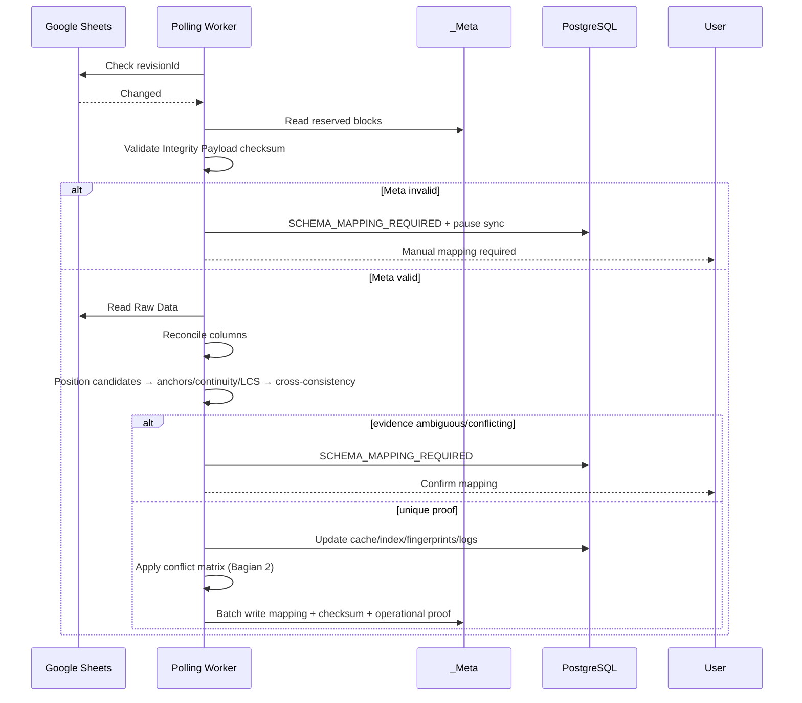

# Architecture Specification v1.0 — SheetViz

## Bagian 3: Google Sheets Mapping (`_Meta`) — Final

**Baseline:** PRD v1.4 (FROZEN) + Bagian 1 (FINAL) + Bagian 2 (FINAL / APPROVED)
**Tanggal:** 9 September 2026
**Status:** Final Candidate untuk Approval
**Sifat dokumen:** Spesifikasi mapping dan aturan deterministik — bukan implementasi kode.

**Changelog v3:** Menutup P1 terakhir dari review: (1) menambahkan konsep **Operational Integrity / Authentication** terpisah dari `integrity_checksum` untuk field operational yang dipakai idempotency/correlation; (2) memperketat definisi identity proof agar wajib **cross-consistent** terhadap seluruh evidence, bukan cukup satu heuristic menghasilkan kandidat.

---

## 3.1 `_Meta` Architecture

`_Meta` adalah tab reserved, hidden, protected, dan bukan data bisnis user. Ia menyimpan persistence identity mapping serta integritas mapping; application state seperti pivot/chart/billing tetap berada di PostgreSQL.

```
A1: SHEETVIZ_META
B1: <meta_schema_version>
C1: <document_id>
D1: <raw_data_sheet_gid>
E1: <meta_revision>
F1: <integrity_checksum>
G1: <updated_at_iso8601>              ← operational metadata
H1: <writer_operation_id>             ← operational metadata

A3: [COLUMN_MAPPING]
A4: column_id | column_position | column_name | data_type | is_deleted | mapping_version
A5..n: column mapping rows

J3: [ROW_MAPPING]
J4: row_id | raw_data_row_index | row_content_fingerprint | row_mapping_version | is_deleted
J5..n: row mapping rows

R3: [INTEGRITY_MANIFEST]
R4: key | value
R5: raw_header_fingerprint | <sha256>
R6: row_mapping_checksum | <sha256>
R7: column_mapping_checksum | <sha256>

R10: [OPERATIONAL_METADATA]
R11: key | value
R12: raw_data_fingerprint_sample | <sha256>
R13: mapping_generated_at | <ISO-8601>
R14: mapping_writer_operation_id | <UUID>
R15: writer_operation_type | <sync/manual_mapping/onboarding/schema_migration/reconciliation>
R16: correlated_sync_operation_id | <UUID or null>
R17: operational_integrity_proof | <authentication/integrity proof>
```

**Kontrak layout:** label blok reserved harus persis; parser hanya membaca range/blok reserved; area lain diabaikan.

---

## 3.2 Column Identity

`column_id` adalah UUID immutable; nama dan posisi mutable. Pivot/chart merujuk `column_id`, bukan header.

| Perubahan Raw Data | Aksi |
|---|---|
| Rename murni, posisi/jumlah sama | Pertahankan `column_id`; update nama; update `_Meta` |
| Append kanan | Generate `column_id` baru |
| Remove paling kanan | Soft-delete mapping; invalidate dependency |
| Insert/delete/reorder di tengah | `SCHEMA_MAPPING_REQUIRED` |
| Header duplikat | UUID tetap identity; jika ambiguity → manual mapping |

---

## 3.3 Row Identity Persistence

`row_id` adalah satu-satunya permanent row identity. `raw_data_row_index` hanya **candidate location**, bukan proof identity.

```
row_id → last-known position candidate
       → anchor + fingerprint + sequence + LCS/Myers evidence
       → cross-consistency validation
       → unique identity proof
       → assign row_id to observed row
       → otherwise SCHEMA_MAPPING_REQUIRED
```

**Aturan cross-consistency (baru):** Identity proof harus konsisten dengan **seluruh** constraint/evidence yang tersedia. Satu metode yang menghasilkan kandidat tidak cukup jika ada evidence lain yang bertentangan. Misalnya, candidate dari LCS tidak boleh diterima jika ia bertabrakan dengan unique anchor atau continuity mapping yang lebih kuat; hasilnya wajib `SCHEMA_MAPPING_REQUIRED`.

| Kejadian | Aturan |
|---|---|
| Input via app | Generate `row_id` sebelum batch write Raw Data + `_Meta` |
| Onboarding | Generate mapping awal; ambiguity harus user-confirmed |
| Insert manual | Row baru hanya mendapat `row_id` setelah mapping existing terbukti konsisten |
| Shift/move | `row_id` dipertahankan hanya dengan proof unik dan cross-consistent |
| Edit content | Fingerprint boleh berubah; `row_id` tetap hanya jika proof context cukup |
| Duplicate/ambiguous | Stop → `SCHEMA_MAPPING_REQUIRED` |

---

## 3.4 Schema Versioning, Integrity, dan Operational Integrity

### 3.4.1 Writer Operation

`writer_operation_id` adalah UUID immutable untuk setiap operasi yang menulis `_Meta`. Ia independen dari `sync_staging`.

| Writer type | `writer_operation_id` | `correlated_sync_operation_id` |
|---|---|---|
| Sync | Sama dengan `sync_operation_id` | Sama |
| Manual mapping | `mapping_operation_id` baru | null |
| Onboarding | `onboarding_operation_id` baru | null |
| Schema migration | `migration_operation_id` baru | null |
| Reconciliation | `reconciliation_operation_id` baru | null |

### 3.4.2 Integrity Payload

`integrity_checksum = SHA256(canonical JSON Integrity Payload)` dan hanya menjamin **mapping state**:

```
{
  schema_version,
  document_id,
  raw_data_sheet_gid,
  meta_revision,
  columns (sorted by column_id),
  rows (sorted by row_id),
  integrity_manifest: {
    raw_header_fingerprint,
    row_mapping_checksum,
    column_mapping_checksum
  }
}
```

Operational field tidak masuk checksum mapping: `updated_at_iso8601`, `writer_operation_id`, `raw_data_fingerprint_sample`, `mapping_generated_at`, `mapping_writer_operation_id`, `writer_operation_type`, dan `correlated_sync_operation_id`.

### 3.4.3 Operational Integrity / Authentication (Baru)

Karena `writer_operation_id` dan `correlated_sync_operation_id` tidak termasuk Integrity Payload, validitas checksum mapping **tidak boleh** dianggap sebagai bukti bahwa operational metadata berasal dari operasi SheetViz yang sah.

**Prinsip terkunci:**

```
integrity_checksum
    → menjamin identity/mapping state

operational_integrity_proof
    → menjamin authenticity/integrity field writer_operation_id,
      writer_operation_type, correlated_sync_operation_id,
      dan metadata operasi yang dipakai untuk idempotency/recovery
```

`operational_integrity_proof` adalah field reserved pada blok `[OPERATIONAL_METADATA]`. Algoritma tepatnya (misal signature/HMAC berbasis secret server, scope key, dan rotasi key) ditentukan di **Bagian 6: Security Model** dan dipakai oleh Bagian 4 API Contract/Bagian 2.11 saat recovery timeout. Namun implementasi apa pun wajib memenuhi aturan berikut:

1. Operational metadata yang digunakan untuk idempotency/correlation **tidak trustworthy hanya karena parsing tipe valid**.
2. Parser wajib memverifikasi `operational_integrity_proof` sebelum memakai `writer_operation_id` atau `correlated_sync_operation_id` sebagai bukti write sudah diterapkan.
3. Proof harus terikat minimal pada `document_id`, `meta_revision`, `writer_operation_id`, `writer_operation_type`, dan `correlated_sync_operation_id` agar tidak dapat dipindahkan/replay ke spreadsheet atau revisi lain.
4. Jika proof tidak valid/missing pada schema yang mewajibkannya, mapping checksum boleh tetap valid, tetapi outcome tetap `SCHEMA_MAPPING_REQUIRED` untuk operasi yang membutuhkan idempotency/recovery verification.

### 3.4.4 Versioning dan Normalisasi

`meta_schema_version` mengatur parser; `meta_revision` BIGINT monoton. Canonical serialization: UTF-8, Unicode NFC, newline `\n`, ISO-8601 UTC, NULL eksplisit, angka tanpa separator, object key alfabetis, array columns/rows UUID lexical.

---

## 3.5 Parsing Rules

```
FUNCTION parse_and_validate_meta(document, spreadsheet, purpose):
    meta := FIND_EXACTLY_ONE('_Meta')
    READ global, mapping blocks, integrity manifest, operational block
    VALIDATE labels/schema/document/GID/UUID/index/uniqueness
    VERIFY mapping block checksums
    VERIFY integrity_checksum against Integrity Payload ONLY
    VERIFY meta_revision monotonic
    VALIDATE operational field types

    IF purpose IN (idempotency_recovery, write_confirmation):
        VERIFY operational_integrity_proof

    RETURN VALID or INVALID
END FUNCTION
```

Malformed UUID, mapping duplikat, checksum mismatch, revision mundur, proof operational invalid untuk purpose yang membutuhkannya → `SCHEMA_MAPPING_REQUIRED`.

---

## 3.6 Write Rules

Hanya backend SheetViz writer sah `_Meta`; frontend tidak pernah memegang token OAuth.

```
FUNCTION write_meta_change(document, changes, writer_context):
    LOCK document context in PostgreSQL
    READ + VALIDATE current _Meta
    next := APPLY(changes)
    next.meta_revision := current.meta_revision + 1
    next.writer_operation_id := writer_context.operation_id
    next.writer_operation_type := writer_context.type
    next.correlated_sync_operation_id := writer_context.sync_id OR null
    next.integrity_checksum := HASH(next.integrity_payload)
    next.operational_integrity_proof := SIGN_OR_AUTHENTICATE(
        document_id, meta_revision, writer_operation_id,
        writer_operation_type, correlated_sync_operation_id
    )
    BATCH_WRITE Raw Data changes + _Meta changes
    VERIFY response then COMMIT PostgreSQL mapping cache/logs
END FUNCTION
```

Jika batch gagal, cache tidak boleh dianggap committed. Jika response timeout, gunakan verification Bagian 2.11 + Section 3.11.

---

## 3.7 Row Reconciliation

`revisionId` hanya change trigger. Index posisi dari `_Meta` hanya candidate; direct mapping dilarang.

```
FUNCTION reconcile_rows(document, observed, meta):
    candidates := FIND_AROUND_LAST_KNOWN_POSITIONS(meta, observed)
    anchors := FIND_UNIQUE_ANCHORS(meta, observed)
    continuity := EVALUATE_SEQUENCE(candidates, anchors)
    IF continuity insufficient:
        alignment := LCS_MYERS_CANDIDATE_ALIGNMENT(meta, observed, anchors)
        continuity := EVALUATE_ALIGNMENT(alignment, anchors)
    IF NOT CROSS_CONSISTENT(anchors, continuity, fingerprints, meta):
        RETURN SCHEMA_MAPPING_REQUIRED
    ASSIGN row_id ONLY to uniquely proven observed rows
    APPLY shifts/inserts/deletion candidates
END FUNCTION
```

Fingerprint adalah content comparison, bukan identity. Duplicate fingerprint tidak pernah menjadi proof tunggal.

---

## 3.8 Column Reconciliation

Rename murni, append kanan, dan remove kanan bisa otomatis. Insert/delete/reorder tengah selalu `SCHEMA_MAPPING_REQUIRED` pada v1.

---

## 3.9 Corruption / Missing `_Meta`

`_Meta` missing/duplicate, label/schema invalid, document/GID mismatch, checksum/proof invalid, revision mundur, UUID/position malformed/duplicate → `SCHEMA_MAPPING_REQUIRED`, pause sync, log security event. Tidak ada auto-regenerate tanpa konfirmasi user.

---

## 3.10 Ambiguity & Manual Mapping

Manual mapping dibuka saat mapping/identity tidak dapat dibuktikan unik dan cross-consistent. UI menampilkan Raw Data terkini, mapping terakhir, serta keputusan match/new/deleted. Keputusan manual menciptakan writer operation type `manual_mapping`, operation ID baru, `meta_revision+1`, integrity checksum baru, dan operational integrity proof baru.

---

## 3.11 Atomicity Raw Data + `_Meta`

Gunakan batch Google Sheets API untuk operasi yang mengubah Raw Data + `_Meta` pada spreadsheet sama [web:16].

Setelah timeout, operasi dianggap sudah diterapkan hanya jika:

```
Raw Data fingerprint == expected payload fingerprint
AND _Meta.writer_operation_id == expected writer_operation_id
AND _Meta.correlated_sync_operation_id == expected sync_operation_id (untuk sync)
AND _Meta.integrity_checksum valid
AND _Meta.operational_integrity_proof valid
```

Jika Raw Data dan `_Meta` tidak konsisten atau proof invalid, jangan tulis ulang buta → pause sync + `SCHEMA_MAPPING_REQUIRED`.

---

## 3.12 Migration / Backward Compatibility

Patch compatible dimigrasi saat write berikutnya; minor melalui background migration; major incompatibility → `SCHEMA_MAPPING_REQUIRED`; `_Meta` tidak ada → onboarding/rebuild explicit. Tidak ada silent downgrade atau penghapusan metadata lama bila migration gagal.

---

## 3.13 End-to-End Mapping Flow



---

## Keputusan Kunci

1. Position adalah candidate, bukan proof identity.
2. Identity proof harus cross-consistent terhadap semua evidence; evidence konflik → manual mapping.
3. `writer_operation_id` adalah identity operation mandiri; sync ID hanya korelasi.
4. `integrity_checksum` menjamin mapping state; `operational_integrity_proof` menjamin authenticity field operational untuk idempotency/recovery.
5. `_Meta` invalid/ambiguous selalu pause sync + manual mapping.

---

**Status Bagian 3:** Final Candidate untuk Approval. Setelah disetujui, lanjut ke **Bagian 4: API Contract**.