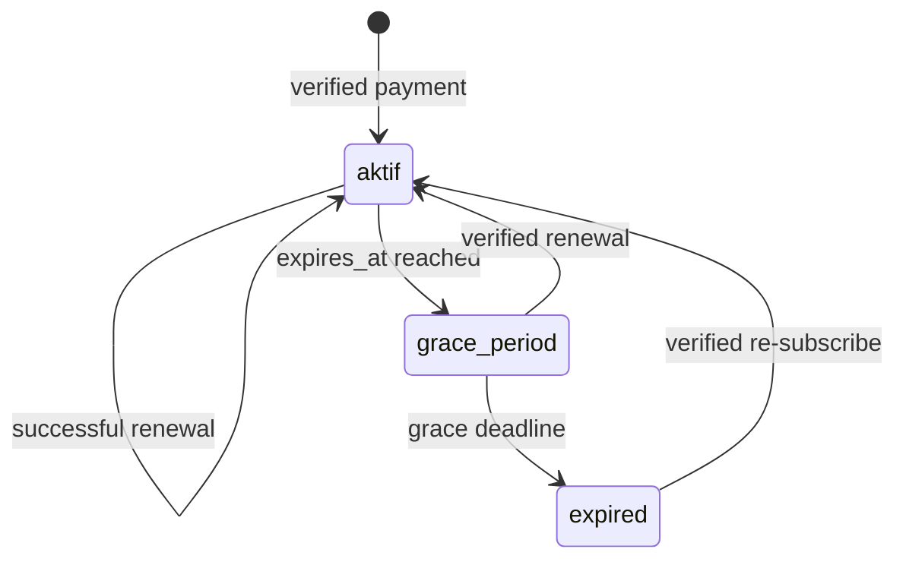
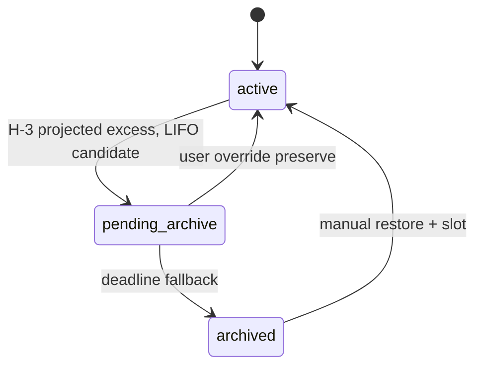

# Architecture Specification v1.0 — SheetViz

## Bagian 5: Entitlement Rules Engine — Revisi v2

**Baseline:** PRD v1.4 + Bagian 1–4 (FINAL / APPROVED)
**Tanggal:** 9 September 2026
**Status:** Revised Draft untuk Review
**Sifat dokumen:** Spesifikasi aturan bisnis, state machine, dan pseudocode deterministik — bukan implementasi kode.

**Changelog v2:** Menutup 3 P0 + 1 P1: (1) formula `allocated_count`/`available`/`excess` disamakan dan selalu memasukkan `pending_archive`; (2) H-3 planning memakai **projected post-expiry entitlement**, bukan effective entitlement grace saat ini; (3) menghapus `FOR UPDATE` yang tidak valid dari `COUNT(*)`, memakai lock `entitlements` sebagai mutex per-user; (4) predicate resolver diberi parentheses eksplisit.

---

## 5.1 Entitlement Domain Model

```
Plan → Subscription → Effective Entitlement → Allocation → Usage → Enforcement
```

**Invariant:** Entitlement, Allocation, dan Usage adalah konsep berbeda.

| Konsep | Definisi | Source of Truth |
|---|---|---|
| Plan | Benefit/harga master | `plans` |
| Subscription | Catatan benefit yang dibeli & lifecycle | `subscriptions` |
| Effective entitlement | Kapasitas berlaku saat ini | `entitlements` materialized projection |
| Projected entitlement | Kapasitas setelah lifecycle future tertentu (misal grace expiry) | Dihitung resolver projection, tidak mengganti effective entitlement saat ini |
| Allocation | Slot resource spesifik | `resource_allocations` |
| Usage | Konsumsi aktual resource | Query lifecycle resource + allocation |
| Enforcement | Guard atomic allow/reject | Transaction + entitlement lock |

### 5.1.1 `resource_allocations`

```sql
CREATE TABLE resource_allocations (
    id UUID PRIMARY KEY DEFAULT gen_random_uuid(),
    user_id UUID NOT NULL REFERENCES users(id) ON DELETE CASCADE,
    resource_type VARCHAR(20) NOT NULL CHECK (resource_type IN ('document', 'pivot')),
    resource_id UUID NOT NULL,
    allocation_status VARCHAR(20) NOT NULL DEFAULT 'active'
        CHECK (allocation_status IN ('active', 'pending_archive', 'archived', 'released')),
    allocation_source VARCHAR(30) NOT NULL
        CHECK (allocation_source IN ('free_tier', 'subscription', 'manual_override', 'system_reconciliation')),
    allocated_at TIMESTAMPTZ NOT NULL DEFAULT now(),
    released_at TIMESTAMPTZ,
    created_at TIMESTAMPTZ NOT NULL DEFAULT now(),
    updated_at TIMESTAMPTZ NOT NULL DEFAULT now(),
    UNIQUE (resource_type, resource_id)
);
CREATE INDEX idx_resource_allocations_user_active
    ON resource_allocations(user_id, resource_type, allocation_status);
```

`resource_id` polymorphic; application wajib validasi owner/jenis resource sebelum insert. ERD Bagian 1 direvisi terkontrol setelah Bagian 5 approved.

---

## 5.2 Entitlement Resolution

`entitlements` adalah materialized projection untuk fast enforcement; input source benefit tetap plan + subscription.

### 5.2.1 Effective Entitlement Saat Ini

```
FUNCTION resolve_effective_entitlement(user_id, now):
    total_documents := 1
    total_pivots := 1

    subscriptions := SELECT p.dokumen_quota, p.pivot_quota
                     FROM subscriptions s JOIN plans p ON p.id = s.plan_id
                     WHERE s.user_id = user_id
                       AND (
                           (s.status = 'aktif' AND s.expires_at >= now)
                           OR s.status = 'grace_period'
                       )

    FOR each subscription:
        total_documents += subscription.dokumen_quota
        total_pivots += subscription.pivot_quota

    RETURN {document_quota: total_documents, pivot_quota: total_pivots}
END FUNCTION
```

Model v1 additive: Free baseline + seluruh subscription `aktif`/`grace_period` yang valid.

### 5.2.2 Projected Post-Expiry Entitlement (P0)

Projected entitlement dipakai untuk planning H-3, **bukan** untuk membatasi benefit user selama grace.

```
FUNCTION resolve_projected_entitlement_after_expiry(user_id, expiring_subscription_ids):
    total_documents := 1
    total_pivots := 1

    subscriptions := all subscriptions currently contributing benefit
    FOR each subscription:
        IF subscription.id NOT IN expiring_subscription_ids:
            total_documents += plan.document_quota
            total_pivots += plan.pivot_quota

    RETURN {document_quota: total_documents, pivot_quota: total_pivots}
END FUNCTION
```

Contoh: current effective quota 5 dalam grace, projected quota setelah satu subscription berakhir = 3; allocation 5 → projected excess 2. Dua candidate boleh direncanakan `pending_archive` pada H-3, tetapi resource tetap editable/aktif sampai deadline grace.

### 5.2.3 Trigger Recalculation

- Webhook payment sukses tervalidasi: aktif/perpanjang subscription → recalc effective entitlement atomik.
- Lifecycle sweep: `aktif → grace_period` (effective benefit tetap) dan `grace_period → expired` (effective entitlement turun + allocation engine).
- H-3 scheduler: hitung **projected** entitlement, buat allocation plan tanpa mengubah effective entitlement.
- Admin plan benefit change: batch recalculation + audit.

---

## 5.3 Quota & Metering

### 5.3.1 Quota v1

| Quota | Contract v1 | Enforced v1 |
|---|---|---|
| Document | Mandatory | Ya |
| Pivot | Mandatory | Ya |
| Row limit | Disiapkan | Tidak, v2 |
| Sync frequency tier | Disiapkan | Tidak, v2 |

### 5.3.2 Formula Konsisten (P0)

Untuk setiap `resource_type`:

```
allocated_count = COUNT(resource_allocations)
                  WHERE allocation_status IN ('active', 'pending_archive')

available = MAX(0, effective_entitled - allocated_count)

excess = MAX(0, allocated_count - effective_entitled)

projected_excess = MAX(0, allocated_count - projected_entitled)
```

| Nilai | Makna |
|---|---|
| `effective_entitled` | Kapasitas saat ini dari `entitlements` |
| `projected_entitled` | Kapasitas masa depan untuk event lifecycle yang diproyeksikan |
| `allocated_count` | Seluruh slot diklaim: `active + pending_archive` |
| `available` | Slot yang benar-benar bisa di-reserve sekarang |
| `excess` | Kelebihan terhadap entitlement efektif saat ini |
| `projected_excess` | Kelebihan terhadap kapasitas yang akan berlaku setelah expiry; khusus allocation planning H-3 |
| `used` | Resource lifecycle aktif; metrik display/integrity, bukan guard utama |

Tidak ada formula yang mengabaikan `pending_archive`; status tersebut tetap mengunci slot sampai archive/release final.

---

## 5.4 Subscription Lifecycle

| Status | Benefit efektif | Makna |
|---|---|---|
| aktif | Ya | Masa bayar berlaku |
| grace_period | Ya | Grace 30 hari, benefit tetap penuh |
| expired | Tidak | Benefit tidak lagi dihitung |



Payment pending/gagal tidak memberi benefit. Lifecycle transition dan entitlement recalc diaudit.

---

## 5.5 Allocation Engine

### 5.5.1 H-3 Planning dengan Projected Entitlement (P0)

```
FUNCTION create_h3_allocation_plan(user_id, resource_type, expiring_subscription_ids):
    projected_quota := resolve_projected_entitlement_after_expiry(
        user_id, expiring_subscription_ids
    )[resource_type]

    allocations := SELECT active + pending_archive allocations
                   WHERE user_id = user_id AND resource_type = resource_type
                   ORDER BY allocated_at ASC, resource_id ASC

    projected_excess := MAX(0, COUNT(allocations) - projected_quota)
    candidates := LAST_N(allocations, projected_excess)  -- LIFO

    FOR candidate IN candidates:
        SET allocation_status = 'pending_archive'
        CREATE/UPDATE allocation queue with notify_at=now(), deadline=grace deadline

    RETURN candidates
END FUNCTION
```

Candidate `pending_archive` adalah planning state; tidak mengurangi effective entitlement dan tidak mengubah access/edit selama grace.

### 5.5.2 Deadline Execution

Saat grace deadline:

```
BEGIN TRANSACTION
LOCK entitlement user FOR UPDATE
transition relevant subscription to expired
recalculate effective entitlement
recount allocated_count (active + pending_archive)
excess := MAX(0, allocated_count - effective_entitled)
apply manual override decisions where valid
archive exactly excess pending allocations using deterministic LIFO fallback
COMMIT
```

Tie-breaker tetap `allocated_at ASC, resource_id ASC`; kandidat paling akhir adalah LIFO.

### 5.5.3 Generalisasi Queue

`entitlement_allocation_queue` harus digeneralisasi dari `target_document_id` menjadi `resource_type + resource_id` agar mendukung document dan pivot. Perubahan ERD Bagian 1 dan API Bagian 4 dilakukan setelah Bagian 5 approved, sebelum coding billing.

---

## 5.6 Enforcement

| Aksi | Guard | Hasil bila quota habis |
|---|---|---|
| Create document | Atomic reserve allocation | `422 ENTITLEMENT_REQUIRED` |
| Create pivot | Atomic reserve allocation | `422 ENTITLEMENT_REQUIRED` |
| Create/batch row | Row quota non-enforced v1 | Allowed, dataset boundary tetap berlaku |
| Sync staging | Tidak mengambil slot baru; validasi document state | Allowed/reject state-specific |
| Restore archived resource | Atomic reserve sebelum restore | `422 ENTITLEMENT_REQUIRED` |

### 5.6.1 Atomic Reserve → Create → Commit (P0 Locking Fix)

```
FUNCTION reserve_and_create_resource(user_id, resource_type, payload):
    BEGIN TRANSACTION

    entitlement := SELECT * FROM entitlements
                   WHERE user_id = user_id
                   FOR UPDATE  -- mutex per-user

    allocated_count := SELECT COUNT(*) FROM resource_allocations
                       WHERE user_id = user_id
                         AND resource_type = resource_type
                         AND allocation_status IN ('active', 'pending_archive')
                       -- no FOR UPDATE on aggregate COUNT

    quota := entitlement[resource_type + '_quota']
    IF allocated_count >= quota:
        ROLLBACK
        RETURN ENTITLEMENT_REQUIRED

    resource := CREATE_RESOURCE(payload, user_id)
    CREATE resource_allocation active for resource
    CREATE idempotency record in same transaction

    COMMIT
    RETURN resource
END FUNCTION
```

Lock `entitlements` adalah mutex serialisasi; semua create/restore/archive yang memengaruhi allocation wajib memakai lock user yang sama. Urutan lock: entitlement → allocation/resource; tidak boleh dibalik.

### 5.6.2 Pre-check

UI boleh tampilkan `GET /billing/entitlement`, tetapi final allow/reject hanya atomic transaction.

---

## 5.7 Concurrency & Atomicity

- `SELECT entitlements ... FOR UPDATE` adalah mutex database per user.
- Setelah lock diperoleh, `allocated_count` selalu dihitung ulang dalam transaksi yang sama.
- HTTP idempotency record dan reserve/create berada pada transaksi yang sama.
- Deadlock internal boleh retry maksimum 2 kali dengan jitter.
- Job rekonsiliasi harian memeriksa `allocated_count <= entitlement`, owner match, lifecycle/allocation consistency; anomaly diaudit, tidak diperbaiki diam-diam.

---

## 5.8 Grace Period & Expiration

| Waktu | Basis quota | Behavior |
|---|---|---|
| H-3 | Projected post-expiry entitlement | Plan allocation; `pending_archive`; user dapat override; resource tetap edit aktif |
| H-1 | Effective entitlement saat ini | Reminder; benefit grace tetap penuh |
| Deadline | Effective entitlement baru setelah expiry | Archive exact excess setelah recalc |
| Re-subscribe | Entitlement efektif baru | User dapat manual restore sesuai slot |

`pending_archive` tetap mengunci slot dalam `allocated_count`, namun bukan penguncian akses sebelum deadline. Archive tidak menghapus Google Raw Data.

---

## 5.9 Manual Override



```
FUNCTION apply_manual_override(user_id, resource_type, preserve_ids):
    BEGIN TRANSACTION
    LOCK entitlements FOR UPDATE
    allocations := SELECT allocations for user/type
                   WHERE status IN ('active','pending_archive')
                   FOR UPDATE

    projected_quota := quota used by pending allocation plan
    IF COUNT(preserve_ids) > projected_quota:
        ROLLBACK; RETURN VALIDATION_ERROR

    VERIFY ownership and candidate eligibility
    mark chosen = active
    mark remaining candidates = pending_archive via deterministic LIFO
    resolve queue = manual_override
    COMMIT
END FUNCTION
```

Override hanya berlaku sebelum deadline dan tidak boleh membuat allocation active melebihi projected quota yang menjadi basis plan.

---

## 5.10 Audit & Observability

Audit wajib untuk entitlement recalc, allocation create/release/archive, H-3 plan, override, lifecycle transition, enforcement reject, dan reconciliation anomaly. Data minimum: before/after quota, resource IDs, decision/tie-breaker, actor/source, transaction/subscription reference, request/task correlation ID.

Metrik: active subscription by plan, recalc failures, enforcement rejection, invariant violation (target zero), pending archive age, override rate, reconciliation anomaly.

---

## 5.11 API/Error Contract Extension

| Kondisi | Code | HTTP | Details aman |
|---|---|---:|---|
| Slot tidak tersedia | ENTITLEMENT_REQUIRED | 422 | type, effective_entitled, allocated_count, available |
| Override melebihi projected quota | VALIDATION_ERROR | 400 | max_preserve_count |
| Bukan owner | RESOURCE_NOT_FOUND | 404 | — |
| Deadline lewat | INVALID_STATE_TRANSITION | 422 | status, deadline_at |
| Entitlement recalculating | INVALID_STATE_TRANSITION | 409 | retry_after optional |
| Allocation invariant anomaly | VERSION_ANOMALY | 409 | support reference |

Endpoint tambahan setelah Bagian 5 approved:
- `GET /api/v1/billing/allocations?resource_type=document|pivot`
- `POST /api/v1/billing/allocations/override`
- `POST /api/v1/billing/allocations/{allocation_id}/restore`

---

## 5.12 End-to-End Flows

### Create Resource

```mermaid
sequenceDiagram
    participant P as PWA
    participant A as FastAPI
    participant D as PostgreSQL
    P->>A: Create document/pivot + Idempotency-Key
    A->>D: BEGIN; lock entitlement
    A->>D: Count active+pending allocation
    alt available
        A->>D: Create resource + allocation + idempotency record; COMMIT
        A-->>P: Accepted/created
    else exhausted
        A->>D: ROLLBACK
        A-->>P: 422 ENTITLEMENT_REQUIRED
    end
```

### H-3 Plan dan Deadline

```mermaid
sequenceDiagram
    participant B as Celery Beat
    participant D as PostgreSQL
    participant U as User
    B->>D: H-3: resolve projected post-expiry entitlement
    B->>D: Mark LIFO projected-excess candidates pending_archive
    B->>U: Notice + manual override option
    alt user override before deadline
        U->>D: Preserve selection, lock entitlement, update plan
    else deadline
        B->>D: Expire subscription; recalc effective entitlement; archive exact excess
    end
```

---

## Keputusan Kunci

1. `allocated_count = active + pending_archive` digunakan konsisten untuk available/excess.
2. H-3 memakai projected post-expiry entitlement; benefit effective grace tidak dipotong sebelum deadline.
3. `entitlements FOR UPDATE` adalah mutex; aggregate COUNT tidak memakai `FOR UPDATE`.
4. Resolver subscription memakai parenthesis eksplisit.
5. Document/pivot quota enforced v1; row/sync tiers future contract.
6. `resource_allocations` adalah source allocation; allocation queue wajib digeneralisasi untuk document/pivot.

---

**Status Bagian 5:** Revised Draft untuk Review. Setelah approved: revisi terkontrol Bagian 1 (ERD) dan Bagian 4 (API) untuk `resource_allocations` + generic allocation queue, lalu lanjut Bagian 6: Security Model.