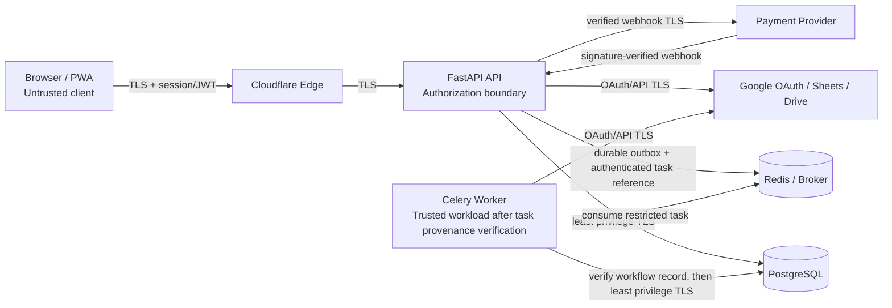

# Architecture Specification v1.0 — SheetViz

## Bagian 6 — Security Model

**Dependencies:** Bagian 1 ERD v3.1, Bagian 2 Sync Architecture, Bagian 3 `_Meta`, Bagian 4 API Contract v3.1, Bagian 5 Entitlement v2 — seluruhnya FINAL / APPROVED.
**Tanggal:** 9 September 2026
**Versi:** v1.1
**Status:** Draft untuk Final Verification
**Sifat dokumen:** Architecture security specification; belum merupakan coding/implementasi.

**Changelog v1.1:** Menutup 1 P0 + 2 P1: (P0) worker hanya mengeksekusi task yang diverifikasi berasal dari internal producer/outbox dan cocok dengan durable workflow record; `user_id` task hanya claim/scoping hint. (P1) tenant context RLS wajib established sebelum tenant query/mutation dan missing/malformed/inconsistent context fail closed. (P1) audit append-only diperkuat dengan privilege database: runtime role hanya INSERT, koreksi dilakukan sebagai event baru.

---

## 6.1 Executive Security Summary

Security SheetViz memakai pendekatan defense-in-depth dengan tiga boundary utama: browser/PWA → API, API/worker → database dan provider eksternal, serta application state ↔ Google Sheets canonical data. Semua allow/reject security-critical harus server-enforced, owner-scoped, auditable, dan fail closed saat integrity atau authorization tidak dapat dibuktikan.

Prinsip utama:

1. **Authenticate principal, authorize every object.** Identitas terautentikasi tidak otomatis memberi akses pada document, pivot, allocation, share, atau operasi sync.
2. **Deny by default.** Missing/invalid session, scope, ownership, token, integrity proof, tenant context, task provenance, dan state transition selalu reject.
3. **Least privilege and separation.** Browser tidak pernah menerima provider refresh token, database credential, worker credential, maupun signing secret.
4. **Canonical integrity protection.** `_Meta` dan mapping tidak hanya data teknis; ia adalah proof operasional untuk identity, mapping, dan safe sync.
5. **Atomic auditable mutation.** Security-sensitive mutation mengikat authorization, state/version guard, idempotency, audit, dan outbox dalam transaction yang konsisten.
6. **Durable workflow authority.** Payload task bukan authority; worker hanya bertindak atas workflow server-side yang durable, authenticated, dan authorized.

---

## 6.2 Security Goals & Non-Goals

### Goals

- Mencegah akses lintas user/tenant pada application state, document cache, allocation, subscription, dan workflow sync.
- Melindungi Google OAuth credentials dan refresh token dari browser, log, audit payload, job payload, dan unauthorized database reader.
- Mencegah replay/retry abuse pada endpoint mutasi melalui idempotency, rate limit, dan request-size validation.
- Menjaga integritas mapping `_Meta`, row/column identity, version/mutation guard, dan sync state ketika Sheets berubah di luar aplikasi.
- Menyediakan audit trail dan incident response yang cukup untuk investigation, containment, dan recovery.
- Memastikan worker tidak menganggap ID tenant/resource pada task queue sebagai authority tanpa verifikasi workflow durable internal.

### Non-Goals

- Tidak menjadikan SheetViz sebagai DLP penuh untuk isi Google Sheets milik user.
- Tidak menjamin keamanan pada browser/device user yang sudah compromised.
- Tidak menggantikan security control Google, payment provider, Cloudflare, atau managed database provider.
- Tidak melakukan redesign keputusan Bagian 1–5; seluruh kontrol di dokumen ini mengimplementasikan boundary yang telah disetujui.

---

## 6.3 Trust Boundaries & Data Classification

### 6.3.1 Trust Boundaries



| Boundary | Input yang tidak dipercaya | Control utama | Fail behavior |
|---|---|---|---|
| Browser → API | Header, body, token, cookie, ID, mutation version | AuthN, schema validation, CSRF, rate limit, idempotency, authorization | 401/403/404/400/422; tidak ada mutation |
| API → PostgreSQL | Query parameter, tenant context, migration | Parameterized query, transaction, RLS, DB role least privilege, mandatory tenant context | Rollback/fail closed; alert bila missing/inconsistent context atau anomaly |
| API/worker → Redis | Task payload, queue routing, task reference | Private network, TLS/auth, producer ACL, durable outbox/workflow record, task signature/serializer allowlist, queue ACL | Reject/quarantine task, no side effect, audit/alert |
| Worker → PostgreSQL | Task claim (`user_id`, document/resource IDs, expected state/version) | Verify provenance against durable record before context; re-authorize binding/version; scoped transaction + RLS | No tenant context/no side effect; quarantine/anomaly |
| API/worker → Google | OAuth token, spreadsheet ID, remote data | Encrypted token, provider scope minimum, owner check, `_Meta` integrity | Pause/reject sync, revoke/re-auth bila perlu |
| Payment provider → API | Webhook payload/header | Raw-body signature verify, timestamp/replay control, event idempotency | 400/401; tidak grant entitlement |

### 6.3.2 Data Classification

| Kelas | Contoh | Storage/transport requirement | Logging rule |
|---|---|---|---|
| Restricted secret | Google refresh token, OAuth client secret, database password, webhook secret, signing key | KMS-backed encryption at rest; TLS in transit; service-only access | Tidak boleh masuk log, metric label, error detail, audit payload, atau task payload |
| Sensitive identity | Email, Google account subject, user ID, IP, session metadata | Encryption at rest/provider controls; TLS; access least privilege | Pseudonymize/minimize; batasi retention |
| Sensitive business data | Cached document cells, pivot output, subscription/payment reference | Tenant isolation, backup encryption, least privilege | Jangan log cell content atau full provider payload |
| Internal integrity data | `_Meta` checksum/mapping, mutation version, fingerprint, sync state, allocation state | Write restricted; auditable mutation | Log identifier/state changes, bukan raw secrets/content |
| Public/low sensitivity | Plan catalog, public static assets | Integrity/version controls | Standard operational logging |

---

## 6.4 Authentication & Session Security

### 6.4.1 Authentication Model

- API menerima credential hanya melalui mekanisme session/JWT baseline Bagian 4; server memverifikasi signature, issuer, audience, expiry, not-before, dan token type sebelum membentuk authenticated principal.
- Principal server minimal berisi immutable internal `user_id`, authentication method, issued/expiry time, dan security/session version. Email atau Google subject bukan substitute untuk authorization object-level.
- Semua request tanpa principal valid ditolak sebelum object lookup/mutation. Endpoint public yang telah didefinisikan Bagian 4 (misalnya share access) memakai token/scope terpisah dan tidak mewarisi session user secara implisit.
- Session renewal/refresh credential hanya berjalan lewat endpoint/auth flow baseline dan tidak dicatat dalam URL, query parameter, client analytics, atau application log.

### 6.4.2 Session Controls

| Control | Requirement |
|---|---|
| Transport | HTTPS-only; HSTS pada production; redirect HTTP ke HTTPS di edge |
| Cookie session (bila dipakai) | `Secure`, `HttpOnly`, `SameSite=Lax` minimum; `SameSite=Strict` bila compatible dengan OAuth callback flow |
| Bearer token (bila dipakai) | Tidak disimpan di localStorage; memory-only atau cookie HttpOnly melalui BFF/session pattern |
| Expiry | Access/session pendek; refresh/session rotation; absolute session maximum sesuai risk policy |
| Revocation | `session_version`/allowlist-denylist server-side; password/security event atau OAuth disconnect menaikkan/menonaktifkan session version |
| Fixation | Regenerate session identifier setelah login, privilege change, dan account recovery |
| Device/session view | User dapat melihat dan revoke session aktif pada v2; bukan prerequisite v1 |

### 6.4.3 Google OAuth Login vs Authorization

Google OAuth untuk login dan Google authorization untuk Sheets/Drive harus dipisahkan secara konseptual walaupun provider sama. Login hanya membuktikan identity; authorization Sheets/Drive menghasilkan credential terbatas yang disimpan server-side dan dapat dicabut/reauthorized tanpa mengubah principal internal secara tidak perlu.

OAuth authorization request wajib menggunakan `state` yang cryptographically random, one-time, short-lived, dan bound ke initiating browser session; gunakan PKCE bila flow/client type memungkinkan. Callback wajib validasi `state`, authorization code exchange hanya server-side, dan redirect URI harus exact allowlisted.

---

## 6.5 Authorization, Ownership & Service Layer

### 6.5.1 Mandatory Authorization Pipeline

Setiap endpoint object-scoped mengikuti urutan:

```text
Authenticate principal
→ Parse/validate route-query-body schema
→ Resolve object dengan owner/share scope di query
→ Authorize action terhadap state + role/scope
→ Apply version/idempotency/entitlement guard
→ Mutate atomically
→ Audit/outbox
→ Respond with request_id
```

Server tidak boleh melakukan `SELECT object by id` lalu authorization secara terpisah bila respons/error dapat membedakan object exists vs tidak owned. Gunakan owner-scoped lookup pada query pertama, misalnya `WHERE id = :id AND user_id = :principal_user_id`.

### 6.5.2 Ownership Rules

| Resource | Owner derivation | Server authorization |
|---|---|---|
| Document | `documents.user_id` | Principal harus owner atau memiliki explicit share scope/action |
| Row/column/chart | Via parent document | Resolve parent dengan owner/share scope sebelum mutation |
| Pivot | `pivot_tables.document_id → documents.user_id` | Resolve join owner-scoped; client tidak memilih owner |
| Allocation | `resource_allocations.user_id` | Owner-scoped allocation lookup + resource type/id cross-check |
| Allocation queue | `entitlement_allocation_queue.user_id` | Internal workflow; user read hanya via owner-scoped allocation endpoint |
| Entitlement/subscription | `user_id` | User hanya melihat own state; perubahan provider/admin melalui trusted server workflow |
| Google connection | Internal user ownership binding | Token hanya dipakai untuk user/document relationship tervalidasi |

### 6.5.3 Service-Layer Enforcement

RLS bukan pengganti service-layer authorization. Service layer wajib memvalidasi action-specific state transition, resource type, parent ownership, allocation/resource cross-check, entitlement status, mutation version, idempotency, dan share permission.

Server derive `user_id` hanya dari authenticated principal; `user_id`, entitlement quota, provider account ID, allocation ownership, dan effective/projected entitlement tidak boleh client-controlled. Owner mismatch, type mismatch, atau unavailable object pada user-facing endpoint memberi `404 RESOURCE_NOT_FOUND` sesuai Bagian 4 untuk menghindari enumeration.

---

## 6.6 PostgreSQL RLS & Database Roles

### 6.6.1 Role Separation

| DB role | Capability | Restriction |
|---|---|---|
| `app_api` | Query/mutate tenant data melalui API transaction | Tidak BYPASSRLS; tidak DDL; `SET LOCAL app.user_id` wajib sebelum tenant SQL |
| `app_worker` | Sync, lifecycle, reconciliation pada data yang ditugaskan | Tidak BYPASSRLS; task provenance wajib tervalidasi; `SET LOCAL` context wajib sebelum tenant SQL |
| `app_migrator` | DDL/migration terkontrol | Tidak dipakai runtime; credential terpisah dan short-lived bila memungkinkan |
| `security_admin` | Operasional terbatas, incident investigation | Just-in-time, audited, MFA; bukan service runtime |
| `read_replica_analytics` | Analytics agregat yang disetujui | No secrets/raw sensitive cells; akses minimal |

Tidak ada runtime role aplikasi yang memakai superuser, owner table, atau `BYPASSRLS`. Table owner harus role non-runtime agar owner bypass behavior tidak menjadi loophole.

### 6.6.2 Tenant Context

API/worker memulai setiap transaction tenant-scoped dengan:

```sql
BEGIN;
SET LOCAL app.user_id = :authenticated_or_verified_workflow_user_id;
SET LOCAL app.request_id = :request_or_task_correlation_id;
-- Query/mutation owner-scoped dan RLS-enforced
COMMIT;
```

`SET LOCAL` wajib berada dalam transaction sehingga context otomatis hilang setelah commit/rollback dan tidak bocor ke pooled connection berikutnya. Nilai context hanya berasal dari principal terverifikasi atau **durable workflow record yang telah lolos verifikasi task provenance**, bukan header/body client maupun claim `user_id` mentah dari payload task.

### 6.6.3 Tenant Context Fail-Closed Invariant (P1)

**TENANT-CTX-01:** Tidak ada transaction tenant-scoped API maupun worker yang boleh mengeksekusi query atau mutation sebelum tenant context established secara eksplisit melalui `SET LOCAL app.user_id` dalam transaction aktif.

**TENANT-CTX-02:** Tenant context yang missing, empty, malformed UUID, tidak cocok dengan authenticated principal, atau tidak cocok dengan durable workflow record yang tervalidasi **HARUS fail closed**. Request/task dihentikan, transaction rollback, tidak ada fallback ke akses unrestricted, dan security/audit signal dibuat tanpa membocorkan data tenant.

**TENANT-CTX-03:** Runtime connection pool wajib menjalankan reset/verification pada checkout/checkin sehingga session variable tidak dapat diwariskan lintas request/task. Verification failure membuat connection dibuang dari pool dan unit kerja gagal tertutup.

Pattern policy menggunakan `current_setting(..., true)` memang menghasilkan nilai null saat context tidak tersedia; null tidak boleh diandalkan sebagai satu-satunya control. Middleware API dan worker transaction wrapper wajib memverifikasi context sebelum tenant SQL, dan RLS policy tetap menjadi defense-in-depth yang menolak row ketika context tidak cocok.

### 6.6.4 Policy Pattern

Contoh pattern untuk tabel owner-scoped:

```sql
ALTER TABLE resource_allocations ENABLE ROW LEVEL SECURITY;
ALTER TABLE resource_allocations FORCE ROW LEVEL SECURITY;

CREATE POLICY resource_allocations_owner_policy
ON resource_allocations
FOR ALL
USING (user_id = current_setting('app.user_id', true)::uuid)
WITH CHECK (user_id = current_setting('app.user_id', true)::uuid);
```

Tabel dengan ownership tidak langsung memakai policy berbasis parent owner (contoh pivot melalui document) atau akses hanya melalui security-definer function yang secara ketat memvalidasi tenant context. Security-definer function harus memiliki `search_path` fixed, parameter typed, ownership non-runtime, input validation, dan audit; hindari bila join policy biasa cukup.

### 6.6.5 RLS Coverage

- Wajib RLS owner-scoped: documents, document rows/columns, pivots, charts, shares non-public, Google connection metadata, entitlements, subscriptions user view, `resource_allocations`, `entitlement_allocation_queue`, idempotency records, audit event view.
- Worker/system lifecycle yang perlu bekerja lintas tenant tidak boleh memakai broad bypass. Worker mengambil task yang sudah scoped dan provenance-verified, memproses satu tenant transaction per waktu, memverifikasi durable record, lalu memakai `SET LOCAL app.user_id` yang cocok sebelum query/mutation.
- Tabel global (plan catalog, migration metadata, provider webhook inbox) memakai role/policy khusus; tidak diekspos langsung ke API user.

---

## 6.7 Secrets, Google OAuth & Token Protection

### 6.7.1 Secret Management

- Semua secret berasal dari managed secret manager/KMS-backed store; tidak di-commit ke repository, image container, PWA bundle, task payload, database migration, atau environment dump.
- Environment variable hanya injection runtime dari secret manager; production log, crash dump, support bundle, dan error tracker memakai secret redaction.
- Gunakan secret terpisah per environment dan per integration; production tidak berbagi OAuth client secret, signing secret, webhook secret, database credential, atau encryption key dengan staging/dev.
- Rotation harus didukung melalui key identifier/version: decrypt credential lama selama overlap terkontrol, encrypt write baru dengan key aktif, lalu revoke key lama setelah migration/verification.

### 6.7.2 Google Token Storage

| Requirement | Control |
|---|---|
| Token placement | Access/refresh token hanya server-side; browser tidak pernah menerima refresh token |
| Encryption | Envelope encryption: data encryption key per record/tenant context, dibungkus KMS key; simpan ciphertext, key version, nonce/IV, auth tag, token metadata terpisah |
| Access | Decrypt hanya API/worker identity yang authorized untuk user/document workflow; least privilege KMS policy |
| Scopes | Minta scope Google paling minimum untuk login, Sheets, Drive; incremental authorization jika fitur baru membutuhkan scope |
| Use | Token hanya dipakai setelah user/document ownership dan connection binding diverifikasi; tidak diteruskan ke worker log/task payload |
| Rotation | Refresh token update atomik; credential lama di-revoke bila disconnect/compromise; refresh failure menandai reconnect required |
| Logging | Tidak log authorization code, access token, refresh token, bearer header, full OAuth callback query, atau provider error payload mentah |

### 6.7.3 OAuth Attack Controls

- Validasi issuer/audience/nonce bila memakai OpenID Connect ID token; jangan percaya email claim tanpa verification provider signature dan account binding.
- `state` dan PKCE verifier bersifat one-time; callback reuse, state mismatch, expired state, atau redirect mismatch ditolak dan diaudit sebagai security signal.
- Google connection record mengikat internal user ID, provider subject, encrypted token reference, approved scope set, issued/expiry metadata, dan connection status.
- Disconnect/revoke harus memutus penggunaan credential segera di application policy, menghapus/cryptographically shred token sesuai retention policy, dan meningkatkan session/security version bila event menandakan compromise.

---

## 6.8 API & Browser Security

### 6.8.1 Input, Output & Transport

- HTTPS wajib end-to-end; Cloudflare edge melakukan TLS modern, WAF/DDoS baseline, request size ceiling, dan bot protection sesuai environment policy.
- FastAPI memakai schema validation ketat, typed UUID/enum/date, body size limit, pagination limit, upload type/size validation, dan parameterized database query; tidak ada dynamic SQL dari client input.
- Response menggunakan allowlist serializer; jangan serialize secret, token metadata sensitif, internal exception, database stack trace, raw Google data, atau audit internal secara default.
- Security headers minimum: HSTS, `X-Content-Type-Options: nosniff`, `Referrer-Policy: strict-origin-when-cross-origin`, `Content-Security-Policy` allowlist, `frame-ancestors 'none'` atau allowlist eksplisit, dan `Permissions-Policy` minimum.

### 6.8.2 CORS & CSRF

| Situasi | Requirement |
|---|---|
| Same-origin PWA + cookie session | Origin allowlist exact; CSRF token/header wajib pada unsafe method; validate Origin/Referer; cookie `Secure`/HttpOnly/SameSite |
| Separate first-party web origin | Allowlist exact per environment; credentials hanya untuk origin tersebut; tidak ada `*` dengan credentials; CSRF tetap wajib bila cookie digunakan |
| Bearer token | CORS allowlist exact; token tidak di localStorage; CSRF tidak menggantikan protection XSS/token theft |
| OAuth callback | Redirect allowlist exact; validasi `state`; callback bukan bypass authorization endpoint lain |

CORS bukan authorization mechanism. Preflight success tidak membuktikan user berhak melakukan action.

### 6.8.3 Abuse Controls & Rate Limits

| Area | Baseline limit policy | Respons |
|---|---|---|
| Login/OAuth start/callback | Rate limit per IP + account/browser signal; progressive backoff | 429/generic response; audit signal |
| Authenticated read | Per user + IP/token bucket, dengan burst terkontrol | 429 + `Retry-After` |
| Mutation (row/doc/pivot/allocation) | Per user + resource + IP; tighter untuk state-changing request | 429; tidak menjalankan mutation |
| Override/restore | Per user + allocation/resource type; anti automation/replay monitoring | 429/409 sesuai kondisi |
| Sync enqueue | Per user/document dan global worker capacity | 429/409; dedupe existing operation baseline |
| Webhook | Per provider source + endpoint; signature gate sebelum expensive processing | 400/401/429; event tidak grant benefit |

Nilai numerik limit ditetapkan per environment melalui configuration dan capacity test sebelum go-live; tidak di-hardcode dalam contract. Semua 429 mengikuti envelope Bagian 4 dan mencantumkan `request_id`; `Retry-After` jika tersedia.

### 6.8.4 Idempotency Abuse

- Idempotency-Key diterima hanya untuk endpoint POST yang dikontrak; batasi panjang/charset, hash sebelum storage, dan jangan pakai key sebagai identifier bisnis atau authorization credential.
- Record idempotency owner-scoped pada authenticated principal + method + normalized route + request body hash; request key sama/body berbeda ditolak mengikuti baseline Bagian 4.
- Entry berada dalam transaction bersama mutation, audit, dan outbox; response replay tidak menjalankan effect baru atau enqueue task baru.
- Terapkan retention/TTL terbatas dan quota per user untuk mencegah storage exhaustion; key frequency/outlier dipantau sebagai abuse signal.
- Jangan leak apakah key dimiliki tenant lain; lookup selalu owner-scoped.

---

## 6.9 Sync, Worker & Provider Trust Boundary

### 6.9.1 API-to-Worker Boundary dan Task Authenticity (P0)

- Broker/Redis hanya private network, TLS/authenticated, tidak internet-exposed, dengan credential terpisah untuk producer/consumer bila platform mendukung ACL.
- Producer task hanya service identity internal yang authorized dan hanya melalui transactional outbox/workflow dispatcher. Browser, public API caller, dan service tanpa producer authorization tidak dapat menulis langsung ke execution queue.
- Payload task hanya berisi ID/metadata minimum (`task_id`, `task_correlation_id`, workflow/outbox record ID, user/document/sync operation ID yang diperlukan, expected mutation/version guard); tidak memuat OAuth refresh token, session token, raw secret, atau raw data besar.
- Task serializer adalah allowlist data-only (misal JSON), tidak menggunakan pickle/deserialization arbitrary code; task name/route allowlisted. Broker message authentication/signature digunakan bila framework/platform mendukung; ini memperkuat tetapi **tidak menggantikan** verifikasi durable record.

**Task execution authority chain (wajib):**

```text
Task received
→ verify queue/consumer authorization and allowed task type
→ verify task authenticity/provenance against durable internal outbox/workflow record
→ verify task_id + task_correlation_id + workflow record state are valid, unconsumed/eligible, and bound to the claimed action
→ derive verified user/document/resource scope from durable record
→ establish transaction-local tenant context
→ re-check current ownership, resource binding, lifecycle, expected operation pairing, and version/mutation guard
→ execute bounded side effect
→ atomically mark workflow/task result + audit/outbox
```

`user_id`, `document_id`, `resource_id`, `sync_operation_id`, expected version, dan claim lain pada payload task adalah **scoping hint**, bukan authority. Worker tidak boleh membentuk tenant context atau mengakses resource hanya karena claim payload menunjuk user/resource yang valid. Semua claim harus cocok dengan durable workflow record internal yang dibuat oleh producer terautorisasi; mismatch, missing record, duplicate/consumed task, invalid state, atau provenance yang tidak dapat diverifikasi harus **fail closed**: tidak ada side effect, task dikarantina/dead-letter sesuai policy, dan security/audit alert dibuat.

Workflow record minimal menyimpan: workflow/outbox ID, task ID unik, task type allowlisted, producer service identity, authenticated/request initiator reference bila ada, authorized tenant/user scope, target resource binding, expected operation/version guard, creation/expiry, status lifecycle, payload hash/reference, serta `request_id`/`task_correlation_id`. Record tersebut bersifat durable dan hanya dapat dibuat/mutasi oleh internal service role melalui transaction yang mengikat authorization awal, state guard, audit, dan outbox enqueue.

- Worker reload token Google server-side hanya setelah authority chain lulus dan ownership/binding divalidasi; token tidak berasal dari payload/log.
- Retry memakai task ID/workflow state idempotent; task duplicate menghasilkan replay no-op atau response workflow sebelumnya, bukan side effect baru.
- Poison task dibatasi retry, dipindah ke dead-letter/error state, diaudit, dan tidak di-loop tanpa batas.

### 6.9.2 Google Sheets/Drive Boundary

- Spreadsheet/document ID dari request adalah untrusted sampai server membuktikan connection owner memiliki akses dan document binding sah.
- Semua Google API call memakai timeout, retry/backoff bounded, allowlisted operation, token scope minimum, dan error redaction.
- Data yang dibaca dari Google Sheets dianggap untrusted input: validasi type/size/formula conventions sebelum masuk cache/staging. Hindari formula injection pada export/render, dan perlakukan cell value yang mulai `=`, `+`, `-`, `@` sesuai policy tampilan/export aman.
- Remote changes yang tidak memenuhi proof `_Meta`, expected mapping, checksum, atau version/fingerprint contract masuk state conflict/anomaly dan tidak boleh diam-diam menimpa canonical/application state.

### 6.9.3 Payment Webhook Boundary

- API menyimpan raw request body sementara hanya untuk signature verification; verify signature dengan constant-time comparison sesuai provider, timestamp tolerance, dan expected event schema sebelum parsing/business logic.
- Deduplicate provider event ID dalam webhook inbox transactionally sebelum grant subscription/entitlement; event duplicate hanya acknowledge sesuai provider policy tanpa mutation kedua.
- Jangan menerima amount, plan, status paid, atau user entitlement dari browser sebagai source of truth; resolve order/reference server-side dan verify mapping provider event → internal payment/subscription.
- Webhook verification failure tidak memberi entitlement dan menghasilkan audit/security signal ter-redaksi.

---

## 6.10 `_Meta` Integrity & Security Proof

`_Meta` adalah control-plane integrity artifact, bukan user-editable business data biasa. Ia menyimpan/mengikat layout, mapping identity, checksum/fingerprint, dan evidence yang dipakai Bagian 2–3 untuk memastikan sync aman.

### 6.10.1 Required Protections

| Risiko | Control |
|---|---|
| `_Meta` dihapus/diubah user | Deteksi existence/layout/schema/version/checksum; sync pause ke conflict/anomaly, jangan auto-repair destruktif |
| Mapping row/column ditukar | Validasi immutable `row_id`/`column_id`, expected pairing, checksum/fingerprint, dan mutation/version guard |
| Remote stale overwrite | Bandingkan `last_synced`, local, remote fingerprint serta expected sync operation pair sebelum write/apply |
| Forged mapping dari external editor | Proof harus diverifikasi terhadap server-stored document binding dan integrity data; remote field saja tidak trusted |
| Sensitive metadata exposure | `_Meta` tidak diekspos oleh API user biasa kecuali subset debug/admin yang terotorisasi; jangan tampilkan internal IDs pada public share |
| Concurrent sync | Lock/guard baseline Bagian 2, `sync_staging_id + expected_sync_operation_id`, dan stale job rejection tetap wajib |

### 6.10.2 Integrity Decision

```text
_Meta proof valid + ownership binding valid + expected state/version valid
→ sync dapat lanjut

_Meta missing/malformed/checksum mismatch/unexpected mapping/version conflict
→ no destructive apply
→ mark conflict/anomaly + audit + user-safe remediation state
```

Aplikasi tidak boleh menganggap `_Meta` sebagai autentikasi user. `_Meta` membuktikan operational mapping/integrity dalam spreadsheet yang sudah diikat ke owner connection; authorization tetap berasal dari principal, server-side ownership relationship, dan provider authorization.

---

## 6.11 Audit Trail, Monitoring & Anomaly Handling

### 6.11.1 Database-Enforced Append-Only Audit (P1)

Audit adalah evidence keamanan dan operasional. Append-only wajib ditegakkan di **database privilege layer**, bukan hanya convention aplikasi.

| Role | Audit table privilege | Larangan/ketentuan |
|---|---|---|
| `app_api` | `INSERT` saja | Tidak memiliki `UPDATE` atau `DELETE`; tidak menjadi table owner; tidak `BYPASSRLS` |
| `app_worker` | `INSERT` saja | Tidak memiliki `UPDATE` atau `DELETE`; tidak menjadi table owner; tidak `BYPASSRLS` |
| `security_admin` | `SELECT` untuk investigasi terbatas dan audited | Tidak melakukan edit event lama sebagai remediation normal; akses JIT + MFA |
| `app_migrator` | DDL terkontrol | Bukan runtime; perubahan schema/retention melalui change ter-review dan audited |

Database hardening wajib mencakup revocation eksplisit atas `UPDATE`/`DELETE` runtime role dan grant hanya `INSERT`/`SELECT` minimum yang diperlukan. Table owner memakai role non-runtime sehingga owner bypass privilege tidak menjadi loophole. RLS audit view membatasi user/API hanya melihat event miliknya yang sudah disanitasi; raw security audit tidak diekspos sebagai endpoint user biasa.

Jika suatu audit event perlu dikoreksi atau diklarifikasi, event original **tidak boleh diubah/dihapus**. Buat event append baru yang mereferensikan event sebelumnya, misalnya `CORRECTION_FOR_B`, dengan reason, actor, timestamp, correlation, dan evidence reference. Retention/purge legal bila dibutuhkan dilakukan melalui workflow administratif terpisah, time-bound, documented, approved, dan menghasilkan audit evidence sendiri; bukan lewat credential runtime aplikasi.

Contoh database privilege intent:

```sql
REVOKE ALL ON audit_events FROM PUBLIC;
REVOKE UPDATE, DELETE, TRUNCATE ON audit_events FROM app_api, app_worker;
GRANT INSERT ON audit_events TO app_api, app_worker;
GRANT SELECT ON audit_events TO security_admin;
```

Implementasi final privilege disesuaikan dengan schema/role deployment, tetapi hasil security-nya wajib sama: runtime API/worker tidak mampu mengubah atau menghapus evidence audit.

### 6.11.2 Audit Events

Audit event dicatat append-only dengan waktu UTC, actor type/user/service, action, target type/ID, tenant/user scope, outcome, `request_id`, `task_correlation_id` bila ada, `sync_operation_id` bila domain sync, before/after state ter-redaksi, source IP/user-agent hash sesuai privacy policy, serta `support_reference` untuk anomaly. Event append baru dapat mereferensikan prior event melalui `correction_for_event_id` atau equivalent immutable reference bila schema audit mendukungnya; detail schema tidak mengubah ERD Bagian 1 pada tahap ini.

| Domain | Event minimum |
|---|---|
| Authentication | Login success/failure, OAuth state failure, session revoke, suspicious refresh/reuse |
| Authorization | Owner/share denial, privilege-sensitive action, RLS denial/error pattern |
| OAuth/token | Connection grant, scope change, refresh/revoke failure, token decrypt/use failure tanpa token value |
| Allocation | Create/release/archive/restore, H-3 plan, override, entitlement rejection, queue resolution |
| Sync | Enqueue/start/end, guard mismatch, `_Meta` anomaly, stale drop, remote conflict, retry/dead-letter |
| Payment | Webhook signature/event validation, dedupe, subscription lifecycle/entitlement recalc |
| Security ops | Secret rotation, admin/JIT access, migration gate failure, incident state transition |

### 6.11.3 Alert & Response Signals

Alert minimum: spike 401/404/429, repeated ownership denial, OAuth state/signature failure, token decrypt/refresh failure, RLS error/tenant context missing, idempotency hash mismatch surge, worker task provenance failure, webhook signature failure, repeated `_Meta` integrity mismatch, allocation invariant violation, queue deadline failure, high dead-letter rate, dan privileged role usage.

`VERSION_ANOMALY` adalah fail-closed integrity signal: jangan auto-heal secara diam-diam. Buat audit event + support reference, blokir mutation unsafe, jalankan reconciliation scoped, dan eskalasi sesuai severity.

---

## 6.12 Threat Model

| Threat | Contoh | Mitigasi utama | Detection/response |
|---|---|---|---|
| Broken object authorization | User mengganti `document_id`/`allocation_id` di URL | Owner-scoped query, service auth, RLS, 404 non-disclosure | Audit denial spike; investigate attempted enumeration |
| Session/token theft | XSS mencuri bearer/local storage | HttpOnly session, CSP, no localStorage token, short expiry/rotation/revocation | Revoke session, rotate credential, notify user bila material |
| CSRF | Site lain mem-post mutation cookie session | CSRF token + Origin/Referer + SameSite | Reject/audit invalid CSRF; investigate campaign |
| OAuth callback attack | State replay/redirect substitution | One-time state, PKCE, exact redirect URI, server exchange | Reject, revoke/reconnect if compromise suspected |
| Google token exposure | Token masuk log/task/client | Server-only encrypted token, redaction, least privilege KMS, payload minimization | Revoke affected token, rotate secrets, assess logs |
| Cross-tenant DB read | Missing tenant context/filter/RLS bypass | TENANT-CTX fail-closed, RLS FORCE, runtime non-BYPASS roles, owner-scoped service query | Alert missing context/RLS errors; contain role/session |
| Quota race/abuse | Parallel create/restore melewati quota | Entitlement mutex, count active+pending, idempotency, rate limit | Reconcile invariant; lock/retry anomalies |
| Worker task injection | Forged task dengan `user_id` korban | Private broker, producer ACL, durable outbox verification, task authority chain, JSON-only, worker reauthorization | Quarantine/DLQ; alert provenance failure; rotate broker credentials |
| `_Meta` tampering | Mapping diubah untuk salah row/column | Checksum/fingerprint/version/pair guards; conflict no destructive apply | Pause sync; reconciliation/remediation |
| Webhook forgery/replay | Fake payment success | Raw signature verify, timestamp, event dedupe, server order mapping | Reject; alert source; review entitlement changes |
| Audit evidence tampering | Runtime bug mencoba UPDATE/DELETE audit event | DB-enforced INSERT-only runtime privilege; correction event append-only | Alert DB permission deny; investigate service/migration access |
| Information disclosure | 403/404 berbeda atau stack trace | 404 owner non-disclosure, safe envelope, no debug prod | Correlate request IDs; patch/revoke if exposure |
| Availability abuse | Login/sync/mutation flood | Edge WAF, rate limits, quotas, bounded retries/DLQ | 429, scale/contain, incident response |

---

## 6.13 Incident Response & Recovery

### 6.13.1 Severity and First Actions

| Severity | Contoh | First action |
|---|---|---|
| SEV-1 | Confirmed cross-tenant exposure, active token/secret compromise, unauthorized entitlement grant at scale, confirmed forged worker task execution | Declare incident, contain affected access, revoke/rotate credential, preserve evidence, stop unsafe workflow |
| SEV-2 | Suspected token leak, repeated webhook/task provenance verification anomaly, widespread sync integrity conflict | Triage immediately, scope impact, pause affected connection/workflow, increase monitoring |
| SEV-3 | Isolated `_Meta` conflict, rate-limit abuse, single reconciliation anomaly | Create case, protect mutation path, remediate scoped data, monitor recurrence |

### 6.13.2 Response Runbook

1. **Detect and triage:** preserve request/task/support references, timestamps, actor/workload identity, affected tenant/resource range; never copy secrets/raw sensitive cells into incident chat.
2. **Contain:** revoke session/token, disable OAuth connection, rotate provider/broker/webhook secret, pause queue or sync per affected scope, tighten rate limit/WAF, revoke privileged DB access.
3. **Eradicate:** fix faulty policy/code/configuration through reviewed deployment; invalidate stale credentials; remove malicious task/data only with forensic record.
4. **Recover:** reconcile allocation/entitlement, document state, `_Meta` mapping, sync pairing/version guard, and payment events before unpausing; reauthorize Google connection if needed.
5. **Communicate:** notify affected users/regulators according to legal/security policy; communicate factual scope, mitigation, dan required user action tanpa disclosing sensitive evidence.
6. **Learn:** post-incident review, timeline, root cause, control gap, owner/date for remediation, validation test, and update threat model/runbook.

### 6.13.3 Backup & Recovery Security

- Backup PostgreSQL dan configuration penting terenkripsi, access-controlled, retention-limited, dan restore diuji berkala dalam environment terisolasi.
- Restore tidak otomatis memulihkan revoked OAuth token ke active use tanpa revalidation; credential/secret recovery mengikuti rotation/revocation status terkini.
- Setelah recovery, jalankan integrity/reconciliation checks untuk tenant isolation, tenant-context enforcement, allocation invariant, subscription entitlement, sync operation pairing, `_Meta` proof, worker workflow/task state, dan audit continuity sebelum membuka mutation traffic.

---

## 6.14 Security Requirements Checklist

### Must-have sebelum production

- [ ] HTTPS/HSTS, security headers, strict CORS, CSRF untuk cookie mutation, CSP production enforced.
- [ ] Session/JWT verification, short expiry/rotation/revocation, no browser refresh token/localStorage bearer token.
- [ ] Owner-scoped service queries dan action-level authorization pada semua object mutation.
- [ ] RLS FORCE untuk tenant tables, runtime non-BYPASS roles, **TENANT-CTX fail-closed** sebelum tenant SQL, pooled connection reset/verification.
- [ ] Google token server-only, envelope-encrypted KMS, minimum scopes, OAuth state/PKCE/redirect validation, redacted logging.
- [ ] Idempotency atomic + owner-scoped + body hash + TTL/quota; rate limits for auth, mutation, allocation, sync, and webhook.
- [ ] Worker broker private/authenticated, producer ACL, JSON-only allowed task, **durable outbox/workflow provenance verification sebelum tenant context**, task reauthorization, bounded retry/DLQ.
- [ ] Payment webhook raw signature verification, replay timestamp/event dedupe, server-side order mapping.
- [ ] `_Meta` integrity proof checked before destructive sync; mismatch fail closed into conflict/anomaly.
- [ ] Audit **database-enforced append-only**: runtime role INSERT-only/no UPDATE/DELETE, correction event append-only, monitoring/alerting, `VERSION_ANOMALY` fail-closed process, tested incident runbooks.
- [ ] Encrypted backup, restore testing, dan post-restore reconciliation.

### Deferred but planned

- [ ] User-facing session/device management.
- [ ] Automated adaptive risk scoring/anomaly detection.
- [ ] Customer-managed encryption keys / advanced enterprise audit export.
- [ ] Formal penetration test, external security review, dan tabletop incident exercise sebelum enterprise launch.

---

## 6.15 Dependencies, Risks & Open Decisions

| Area | Dependency/risk | Decision/owner needed |
|---|---|---|
| Auth mechanism | Baseline Bagian 4 menyebut session/JWT but exact implementation shape belum selected | Pilih primary production pattern: server session cookie/BFF atau JWT with refresh rotation; Security + Backend before implementation |
| KMS/secret manager | Envelope encryption but provider/tooling not named | Pilih cloud KMS and secret manager, key rotation SLA, access policy owner |
| RLS rollout | Existing schema must classify all tenant/global tables and test tenant context enforcement/pool leakage | Backend/DB owner produces policy matrix + integration tests before production |
| Worker workflow ledger | Durable outbox/workflow record is mandatory task authority source; schema/tooling belum dipilih | Backend/Security choose ledger/outbox persistence, producer identity, task signature, expiry/replay policy before implementation |
| Google scopes | Exact feature scope may affect required OAuth permissions | Product + Security review minimum scope and Google verification requirements |
| Rate limits | Numbers depend on capacity/user behavior | SRE/Backend set initial config via load test, then monitor/tune |
| Audit retention | Privacy/legal needs vary by market; append-only retention/purge requires governed process | Legal/Security define retention, access, correction, deletion, and incident evidence policy |
| Payment provider | Tripay/Midtrans may differ in signature/replay semantics | Backend validates provider-specific webhook spec before integration |
| Public shares | Existing Part 4 share scope details govern token handling | Security review public-share expiry/revocation/password controls before launch |

---

## 6.16 Controlled Revision Assessment

Bagian 6 v1.1 tidak membuka atau mengubah keputusan final Bagian 1–5. Tiga penguatan ini memperjelas implementation security boundary: task payload bukan authority dan worker bergantung pada durable internal workflow; tenant context RLS mandatory/fail-closed; audit evidence runtime append-only secara database-enforced.

Jika keputusan open pada auth pattern, KMS provider, workflow ledger, atau public-share detail menghasilkan perubahan contract/schema yang material, perubahan tersebut harus masuk melalui controlled revision pada Bagian terkait; tidak boleh dimasukkan diam-diam saat coding.

---

**Status Bagian 6 — Security Model v1.1:** Draft untuk Final Verification. Belum ada coding/implementasi. Setelah tiga koreksi dikonfirmasi, Bagian 6 menjadi baseline security architecture **FINAL / APPROVED**.