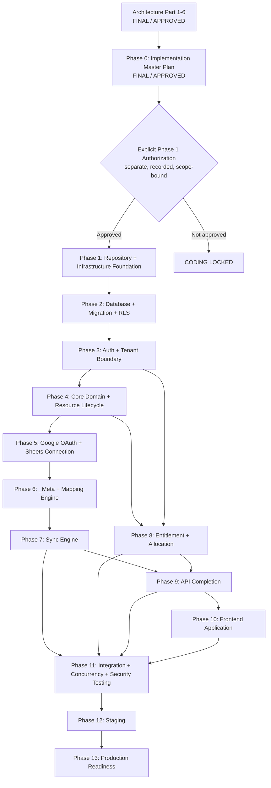

# SheetViz — Implementation Master Plan & Traceability

**Version:** v1.0
**Date:** 9 September 2026
**Status:** Draft untuk Final Verification
**Purpose:** Dokumen transisi resmi dari Architecture Phase yang terkunci ke implementation work yang terkontrol. Dokumen ini bukan pengulangan Architecture Specification Bagian 1–6 dan bukan authorization untuk mulai coding sebelum dokumen ini disetujui **dan Phase 1 memperoleh explicit authorization terpisah**.

**Governance clarifications (v1.0 final-review):** (1) approval dokumen tidak otomatis membuka coding; Phase 1 memerlukan authorization eksplisit terpisah, (2) traceability memiliki lifecycle hingga evidence verified/accepted, (3) phase hanya closed berdasarkan evidence dan formal phase review, bukan code completion.

---

## 1. Purpose & Scope

Dokumen ini menjadi GPS implementasi SheetViz: menghubungkan kontrak arsitektur dengan struktur repository, sequence delivery, ownership boundary, test evidence, migration/deployment gate, dan change control. Setiap pekerjaan implementation harus dapat ditelusuri kembali ke requirement arsitektur yang disetujui.

**In scope:** roadmap delivery, dependency order, repository/runtime target, engineering rules, traceability matrix, test strategy, migration/deployment gates, definition of done, dan open implementation decisions.

**Out of scope:** coding, pemilihan vendor final yang belum diputuskan, redesign Part 1–6, UI mockup detail baru, dan perubahan kontrak tanpa controlled revision.

---

## 2. Locked Architecture Baseline

Seluruh artefak berikut immutable sebagai architecture baseline. Implementasi wajib mematuhi kontrak ini; ambiguity atau conflict harus melalui Change-Control Procedure pada Bagian 21.

| Baseline | Status | Implementation anchor |
|---|---|---|
| Bagian 1 — System Architecture + ERD v3.1 | FINAL / APPROVED | Data model, identity, state, ERD, allocation/queue, migration invariant |
| Bagian 2 — Sync Architecture | FINAL / APPROVED | Sync lifecycle, outbox, staging, guard, worker flow |
| Bagian 3 — `_Meta` Mapping | FINAL / APPROVED | Canonical mapping/layout/checksum/integrity proof |
| Bagian 4 — API Contract v3.1 | FINAL / APPROVED | Route/envelope/error/idempotency/correlation contract |
| Bagian 5 — Entitlement Rules v2 | FINAL / APPROVED | Quota, allocation, projected entitlement, lifecycle/enforcement |
| Bagian 6 — Security Model v1.1 | FINAL / APPROVED | AuthZ, RLS, secrets, worker provenance, audit, fail-closed controls |

**Immutable does not mean unchangeable forever.** Perubahan hanya sah melalui architecture impact analysis, controlled revision, approval, baseline update, dan traceability update. Kode tidak boleh diam-diam menjadi source of truth baru.

---

## 3. Non-Negotiable Rules

### Architecture and change control

1. **No coding before two approvals.** Approval Implementation Master Plan ≠ authorization coding. Coding hanya boleh dimulai setelah: (a) dokumen ini FINAL / APPROVED, dan (b) ada **Phase 1 Authorization** eksplisit yang terpisah, tercatat, dan scope-bound.
2. **Architecture baseline is authoritative.** Bagian 1–6 mengalahkan assumption, shortcut, atau interpretasi implementasi.
3. **No silent redesign.** Schema/API/state/security rule baru atau perubahan meaning existing wajib trace ke baseline atau controlled revision.
4. **Stop on architecture conflict.** Jika implementation menemukan conflict/ambiguity material, hentikan scope terkait dan jalankan Bagian 21.
5. **Phase completion requires evidence, not code completion.** Checklist kode selesai, PR merged, atau coverage target tercapai tidak cukup untuk menutup phase. Phase hanya dapat CLOSED setelah test/security/migration/operational evidence tersedia, traceability berstatus minimal `Verified` untuk scope phase, upstream invariants dan dependency exit gates terbukti hijau, risks terdokumentasi/diterima owner, dan formal Phase Review menghasilkan keputusan close.

### Authority and access

6. **Client ≠ authority; ID ≠ permission.** `user_id`, owner, plan/quota, provider identity, lifecycle state, dan privilege tidak boleh berasal dari client claim.
7. **Task payload ≠ authority.** Worker hanya menjalankan task dari durable internal workflow/outbox record yang provenance-nya tervalidasi.
8. **RLS ≠ sole authorization.** Service layer owner/action/state authorization wajib; RLS merupakan defense-in-depth.
9. **Missing/unknown/inconsistent context fails closed.** Tidak ada destructive action atau tenant query/mutation saat context, integrity proof, provenance, atau state tidak terverifikasi.

### Data, sync, and security

10. **Google Sheets remains canonical for user data** sesuai Part 1–3; PostgreSQL cache/application state tidak boleh silently overwrite remote canonical data saat conflict/integrity unknown.
11. **`_Meta` ≠ authentication.** `_Meta` adalah integrity/mapping proof, bukan authorization identity.
12. **Immutable IDs remain immutable.** `row_id` dan `column_id` tidak pernah diturunkan dari mutable row/column position.
13. **Version and pairing guards are mandatory.** Mutation version, fingerprint, `sync_staging_id + expected_sync_operation_id`, dan state separation tidak boleh dibypass.
14. **Audit is DB-enforced append-only.** Runtime API/worker hanya boleh insert; correction memakai event baru, bukan edit/delete evidence.
15. **Secrets and refresh tokens are server-only.** Tidak boleh masuk browser, log, error, audit payload, task payload, repository, atau client bundle.
16. **Atomic security-sensitive mutation.** Authorization, lock/guard, mutation, idempotency, audit, dan outbox mengikuti transaction boundary yang relevan.

### Delivery quality

17. **Every migration is backward-safe.** Additive/backfill/verify/enforce/retire sequence; hard safety gates, rollback/recovery plan, dan tested upgrade path wajib.
18. **Every concurrency-sensitive operation requires a concurrency test.** Minimal entitlement reserve/restore, override, sync guard, worker duplicate/retry, dan idempotent replay.
19. **No direct sensitive-data bypass.** Akses tenant/object-sensitive data wajib melalui repository/service policy yang enforcement-nya dapat diuji; raw DB access hanya migration/admin break-glass audited.
20. **No production deployment without evidence.** Required test, migration rehearsal, security gate, monitoring, rollback plan, and approval evidence harus tersedia.

---

## 4. Target Repository Architecture

Target adalah monorepo dengan clear ownership boundary; nama folder dapat disesuaikan selama tanggung jawab dan import boundary tetap sama.

```text
sheetviz/
├── backend/                         # FastAPI application
│   ├── app/
│   │   ├── api/                     # Route/controller, schema, response envelope
│   │   ├── auth/                    # Session/JWT, principal, OAuth flow, CSRF
│   │   ├── domain/                  # Pure business rules/state transitions
│   │   ├── services/                # Orchestration: authz, transaction, outbox
│   │   ├── repositories/            # DB query, RLS-aware data access
│   │   ├── models/                  # ORM models, DB mapping only
│   │   ├── integrations/            # Google/payment clients, provider adapters
│   │   ├── security/                # tenant context, crypto, audit, rate limit policy
│   │   ├── sync/                    # sync orchestration, staging, guards
│   │   ├── entitlement/             # resolver, allocation, lifecycle enforcement
│   │   ├── worker/                  # task dispatch/provenance verification adapters
│   │   ├── outbox/                  # durable workflow/outbox dispatcher
│   │   ├── config/                  # validated config; no secret values committed
│   │   └── main.py
│   ├── alembic/                     # schema migrations; migration safety gates
│   ├── tests/
│   │   ├── unit/
│   │   ├── integration/
│   │   ├── contract/
│   │   ├── concurrency/
│   │   ├── security/
│   │   └── e2e/
│   └── pyproject.toml
├── worker/                          # Celery runtime entrypoint/deployment
│   ├── app/                         # Thin bootstrap; imports shared backend domain/services
│   ├── tests/
│   └── pyproject.toml
├── frontend/                        # PWA/web application
│   ├── src/
│   │   ├── features/                # auth, documents, mapping, sync, pivot, chart, billing
│   │   ├── api/                     # typed API client generated/validated from contract
│   │   ├── state/                   # client state; never authority for permission
│   │   ├── components/
│   │   ├── routes/
│   │   └── security/                # CSRF/session-safe request helpers
│   ├── tests/
│   └── package.json
├── shared/                          # Versioned shared non-secret artifacts
│   ├── api-contract/                # OpenAPI/schema fixtures/error catalog
│   ├── domain-fixtures/             # deterministic fixtures only
│   └── test-vectors/                # _Meta/checksum/security test vectors
├── infra/                           # IaC/deployment config, no secret values
│   ├── environments/
│   ├── database/
│   ├── redis/
│   ├── observability/
│   └── ci/
├── docs/
│   ├── architecture/                # locked Part 1–6 + controlled revisions
│   ├── implementation/              # this plan, ADRs, traceability updates
│   └── runbooks/
└── README.md
```

### Repository Boundaries

| Layer | May do | Must not do |
|---|---|---|
| API route | Validate transport schema, derive principal, invoke service, map approved envelope | Business mutation directly, raw SQL, provider token handling |
| Service | Authorize, open transaction, call domain/repository, append audit/outbox | Trust client owner/entitlement, bypass RLS/context |
| Domain | Deterministic rules, state transitions, invariant calculation | HTTP, ORM session, network calls, secret access |
| Repository | Parameterized persistence/query under tenant context | Decide authorization policy, expose unscoped object lookup |
| Integration adapter | Provider protocol, timeout/retry/redaction | Business authorization or tenant policy bypass |
| Worker | Verify workflow provenance, establish context, invoke same service/domain | Trust payload as authority, execute arbitrary task/data |
| Frontend | UX, display state, safe API request | Authorize itself, store refresh token, enforce business invariant alone |

---

## 5. Technology / Runtime Matrix

| Area | Target technology/runtime | Contract/constraint | Open implementation decision |
|---|---|---|---|
| Backend API | Python + FastAPI | Part 1/4 response, auth, idempotency, request correlation | Python/FastAPI version pin |
| Database | PostgreSQL | Part 1 ERD; Part 6 RLS FORCE, tenant context, DB audit privilege | Managed provider/version/HA topology |
| Migration | Alembic | Backward-safe, CR-1E hard gates, rehearsal/rollback evidence | Migration CI policy/tooling detail |
| Cache/broker | Redis | Private/authenticated, queue ACL, no secret payload | Managed provider, TLS/ACL configuration |
| Async worker | Celery | Durable outbox/workflow authority, JSON-only tasks, bounded retry/DLQ | Celery/broker topology and signing implementation |
| Frontend | TypeScript PWA framework | API contract, no client authority/secrets, CSRF/session-safe client | Framework/library version (React assumed only if confirmed) |
| Google integration | OAuth/OIDC + Google Sheets/Drive APIs | Server-only encrypted token, min scopes, `_Meta` proof | Exact OAuth scopes and Google verification plan |
| Payment | Tripay/Midtrans adapter | Raw signature verify, timestamp/event dedupe, server order mapping | Provider selection and webhook specifics |
| Edge | Cloudflare | TLS/HSTS, WAF, DDoS, rate limit/security headers | Rule configuration and environment topology |
| Secrets/KMS | Managed secret manager + KMS | Envelope encryption, rotation, environment isolation | Cloud/provider selection, key hierarchy/rotation SLA |
| Observability | Structured logs, metrics, tracing, alerting | Redaction, request/task correlation, append-only audit | Vendor/tool selection and retention |
| CI/CD | Pipeline + IaC | Contract/test/security/migration gates, promotion approvals | CI provider, artifact signing/SBOM policy |

No secret, access token, refresh token, production credential, signing key, atau private endpoint disimpan dalam repository atau shared artifact.

---

## 6. Implementation Dependency Graph



**Authorization invariant (IMPL-AUTH-01):** Approval dokumen ini hanya menetapkan Implementation Master Plan sebagai baseline controlled. Ia **tidak** secara otomatis memberi izin coding pada phase mana pun. Coding hanya unlock untuk Phase 1 setelah explicit Phase 1 Authorization yang terpisah, tercatat, scope-bound, dan menyatakan owner, target outcome, serta applicable non-negotiable rules. Authorization Phase 1 tidak otomatis mengizinkan Phase 2 atau phase selanjutnya; setiap phase dimulai setelah upstream Phase Close evidence dan explicit authorization sesuai governance proyek.

**Dependency rule:** sync tidak boleh diimplementasikan sebagai end-to-end feature sebelum database identity, auth/tenant boundary, resource lifecycle, Google connection, `_Meta`, mapping, outbox/workflow provenance, dan worker guard tersedia. Entitlement tidak boleh final sebelum lifecycle resource dan entitlement mutex/RLS boundary tersedia.

---

## 7. Implementation Phases

| Phase | Scope & primary deliverable | Prerequisite | Entry authorization | Exit gate / Definition of Done | Complexity |
|---|---|---|---|---|---|
| 0 | Approve Master Plan, assign technical owners, resolve first decisions | Part 1–6 locked | Architecture Phase complete | Document FINAL / APPROVED; Phase 1 remains locked pending separate authorization | Medium — governance/dependency alignment |
| 1 | Monorepo, local/dev environment, CI skeleton, IaC skeleton, config validation | Phase 0 closed | **Explicit Phase 1 Authorization** | Reproducible local stack; CI lint/test; no secrets committed; branch protections; traceability evidence verified; formal Phase Review | Medium — cross-runtime foundation |
| 2 | PostgreSQL schema, migrations, indexes, RLS roles/policies, audit privileges | Phase 1 closed | Explicit Phase 2 Authorization | Clean install + upgrade rehearsal; RLS fail-closed tests; CR-1E migration gates; evidence verified; formal Phase Review | High — irreversible data/security foundation |
| 3 | Auth/session/JWT pattern, principal, tenant middleware, authorization service, CSRF/CORS | Phase 2 closed + auth decision | Explicit Phase 3 Authorization | AuthN/AuthZ/RLS integration tests; missing context fails closed; evidence verified; formal Phase Review | High — security boundary is foundational |
| 4 | Core domain: document/row/column/pivot/chart lifecycle, version/state guards, repositories/services | Phase 3 closed | Explicit Phase 4 Authorization | Domain invariants/unit tests; object owner boundaries; no direct route mutation; evidence verified; formal Phase Review | High — canonical identity/state model |
| 5 | Google OAuth connection, encrypted token store, provider adapter, scopes/reconnect | Phase 3–4 closed + KMS/OAuth decision | Explicit Phase 5 Authorization | OAuth state/PKCE tests; token never in client/log/task; connection ownership proof; evidence verified; formal Phase Review | High — third-party credential boundary |
| 6 | `_Meta` reader/writer/validator, mapping/checksum/fingerprint test vectors | Phase 4–5 closed | Explicit Phase 6 Authorization | Valid/malformed/tampered `_Meta` tests; fail closed, no destructive apply; evidence verified; formal Phase Review | High — canonical mapping integrity |
| 7 | Sync engine: staging/outbox/workflow ledger, worker provenance, Sheets read/write, guards/retry/DLQ | Phase 6 closed + worker ledger decision | Explicit Phase 7 Authorization | Duplicate/stale/tampered task tests; sync pairing/version proof; recovery paths; evidence verified; formal Phase Review | High — concurrency + external canonical system |
| 8 | Entitlement resolver, allocation/queue, H-3 plan, deadline/archive, override/restore enforcement | Phase 2–4 closed + payment integration design | Explicit Phase 8 Authorization | Lock/concurrency/idempotency tests; active+pending formula; grace/projection flows; evidence verified; formal Phase Review | High — financial/access correctness |
| 9 | Complete approved API surface, contract fixtures, error/correlation/idempotency integration | Phase 4, 7, 8 closed | Explicit Phase 9 Authorization | API contract tests pass; no contract drift; security/error cases covered; evidence verified; formal Phase Review | High — cross-domain integration |
| 10 | PWA UX: auth, documents, mapping, sync, pivot, chart, billing/allocation | Phase 9 closed | Explicit Phase 10 Authorization | E2E critical user journeys; no client-side authority/secrets; accessibility baseline; evidence verified; formal Phase Review | High — broad product surface |
| 11 | Cross-system integration, concurrency, security, performance, E2E test suite | Phase 7–10 closed | Explicit Phase 11 Authorization | Required test matrix passes; threat controls verified; defect severity gate met; evidence verified; formal Phase Review | High — evidence across components |
| 12 | Staging, production-like migration rehearsal, monitoring/alerts, UAT | Phase 11 closed | Explicit Phase 12 Authorization | Go/no-go evidence, restore rehearsal, incident drill, UAT sign-off; formal Phase Review | High — operational validation |
| 13 | Production readiness and controlled launch | Phase 12 closed | Explicit Phase 13 Authorization | Security/ops/product approval; rollback and support plan; launch checklist; formal Phase Review | High — irreversible launch risk |

**Phase completion chain (mandatory):**

```text
Implementation complete
→ Required tests pass
→ Security/migration/operational evidence attached
→ Traceability status Verified for scoped requirements
→ Upstream invariants and dependency exit gates verified
→ Risks documented and accepted by owner where applicable
→ Formal Phase Review
→ Phase CLOSED
```

A phase must not be marked closed because its coding checklist is complete. A phase can be returned to active status if final verification or phase review reveals missing evidence, failed invariant, dependency regression, or unresolved risk.

**Sequencing note:** Phases can contain limited parallel preparation only when their prerequisite boundary remains intact. No team may expose a dependent feature to users before its upstream exit gate is met.

---

## 8. Database Implementation Plan

### Delivery sequence

1. Establish PostgreSQL roles, non-runtime table owner, migration role, schema ownership, TLS, backup baseline, and connection pool policy.
2. Implement core Bagian 1 schema in dependency order, including immutable identities, FK/check constraints, state fields, indexes, and audit table.
3. Add tenant scoped RLS with `FORCE ROW LEVEL SECURITY`; implement tenant context wrapper and test missing/malformed/mismatched context fail closed.
4. Apply `resource_allocations` and generalized `entitlement_allocation_queue` with all CR-1A to CR-1E requirements.
5. Enforce audit database permissions: runtime roles insert-only, no update/delete/truncate; non-runtime owner.
6. Build reconciliation queries/jobs as read/detect-first controls; remediation is explicit, audited, and transactionally guarded.

### Migration rules

| Rule | Required evidence |
|---|---|
| Additive first | Migration plan identifies new nullable/additive objects before enforcement |
| Backfill safety | Backfill is idempotent, batched, observable, and has a durable progress/retry plan |
| Hard gates | Gate queries must return zero rows before NOT NULL/FK/CHECK/drop legacy; CR-1E exact-one mapping mandatory |
| Backward compatibility | Application release sequence supports old/new schema overlap; no deploy requires simultaneous unsafe switch |
| Rollback/recovery | Forward-fix preference for destructive/enforced migration; backup/restore/reconciliation plan documented |
| Performance | Index/concurrent index plan and lock impact reviewed using production-like data volume |
| RLS/privilege | New tenant table has policy/role review before API/worker use; audit privileges regression-tested |
| Evidence | Clean install, upgrade, downgrade/forward recovery rehearsal, gate output, and approval attached to release |

### Required database tests

- FK/check/unique/index behavior, including `(resource_type, resource_id)` allocation uniqueness.
- RLS tenant isolation for API and worker roles; missing/malformed context rejects.
- `app_api`/`app_worker` cannot update/delete/truncate audit evidence.
- Allocation count always includes `active + pending_archive`.
- Queue only has one unresolved row per allocation and references matching user/type/resource.
- CR-1E backfill fails/aborts on orphan, mismatch, or ambiguous legacy mapping.

---

## 9. Backend Implementation Plan

### Service and domain sequence

1. Build configuration bootstrap, request ID middleware, typed errors/envelope adapter, structured redacted logging, database transaction wrapper, and tenant context wrapper.
2. Implement principal/authentication integration and centralized authorization service before object mutation services.
3. Implement domain state machines and pure invariant calculators: resource lifecycle, mutation/version guard, allocation status, entitlement formulas, and error mapping.
4. Implement repositories that require tenant context and owner-scoped access; prohibit generic unscoped `get_by_id` for tenant objects in production service paths.
5. Implement service orchestration for document/pivot resource mutations, outbox/audit/idempotency transaction composition, and provider adapter invocation.
6. Implement contract tests against approved Bagian 4 routes/envelope/error behavior; API routes stay thin.

### Backend Definition of Done

- Every endpoint derives principal server-side and uses service authorization.
- Every tenant transaction has verified `SET LOCAL app.user_id`; no fallback context.
- Error response follows Bagian 4 envelope and safe disclosure rule.
- Mutating endpoints use idempotency/correlation as required.
- Audit/outbox are committed with the business mutation when the flow requires it.
- Unit, integration, contract, and negative authorization tests pass.

---

## 10. Worker Implementation Plan

### Worker architecture sequence

1. Build durable workflow/outbox ledger before feature task handlers; define task type allowlist, task ID, producer identity, tenant/resource binding, payload hash/reference, status/expiry, and correlation references.
2. Implement transactional outbox dispatcher with authenticated producer credential and broker routing/ACL configuration.
3. Implement worker pre-execution gate: allowed task type → queue/producer check → durable workflow lookup → task ID/correlation/state/binding verification → derive scope → establish tenant context → revalidate current ownership/version/state → execute.
4. Use shared backend services/domain rules; worker must not create a parallel authorization or data mutation path.
5. Add bounded retry, idempotent completion, duplicate/no-op handling, DLQ/quarantine, and redacted audit/metrics.
6. Add sync/lifecycle/entitlement task handlers only after the common provenance gate is testable.

### Worker Definition of Done

- Forged, unknown, expired, consumed, mismatched, or duplicate task fails closed without side effect.
- Task payload never carries OAuth refresh token, session token, secret, or authority not reconstructable from durable record.
- Worker transaction uses verified workflow tenant context and RLS.
- Retry cannot duplicate mutation, provider effect, allocation, or entitlement grant.
- DLQ and alert are observable and have a runbook.

---

## 11. Google Sheets Integration Plan

1. Decide exact scopes and OAuth consent/verification approach; document minimum scope justification.
2. Implement OAuth authorization code flow server-side with state, PKCE where applicable, exact redirect validation, encrypted token persistence, provider subject binding, and revoke/reconnect lifecycle.
3. Implement Google API adapter with timeout, bounded retry/backoff, error normalization/redaction, rate-limit awareness, and dependency injection for tests.
4. Validate spreadsheet/document ownership and connection binding before all read/write operations; spreadsheet IDs from client/task are untrusted hints.
5. Treat all remote Sheets content as untrusted input; apply size/type/schema/formula-safety validation before cache/staging/render/export.
6. Integrate provider failure modes into user-safe reconnect/conflict states; no token/raw provider error leakage.

### Definition of Done

- OAuth replay/state/redirect attacks are rejected by automated tests.
- Tokens are encrypted server-side and absent from browser, logs, task payloads, test snapshots, and errors.
- Read/write adapter contract tests cover success, expired/revoked permission, timeout, rate limit, and malformed remote data.
- Connection/document binding is validated before provider use.

---

## 12. `_Meta` Implementation Plan

1. Convert Bagian 3 mapping contract to versioned schemas and deterministic fixtures/test vectors.
2. Build `_Meta` reader/parser that validates required layout, schema version, IDs, checksum/fingerprint, and safe size bounds.
3. Build writer that emits canonical stable ordering/layout and updates expected server-side mapping/fingerprint only through guarded sync workflow.
4. Build validator that compares remote `_Meta` with server-stored document binding, immutable row/column identities, expected operation pairing, fingerprints, and mutation version.
5. Define result classification: valid, missing, malformed, checksum mismatch, unexpected mapping, stale/version conflict; only valid proof permits destructive apply.
6. Expose user-safe remediation states; raw `_Meta`/internal IDs remain hidden from ordinary API/public share output.

### Definition of Done

- Deterministic read/write round-trip vector tests pass.
- Missing/malformed/tampered/mismatched `_Meta` cannot cause destructive sync action.
- Mapping uses immutable `row_id`/`column_id`, never mutable position as identity.
- All validator outcomes map to approved sync state/audit/correlation behavior.

---

## 13. Entitlement Implementation Plan

1. Implement subscription lifecycle source and effective entitlement resolver with explicit resolver predicate grouping.
2. Implement projected post-expiry entitlement resolver; it must not replace current effective grace benefit.
3. Implement `resource_allocations` reserve/create/archive/release/restore state transitions and generic queue operations.
4. Implement atomic quota enforcement: entitlement row mutex → count `active + pending_archive` (no aggregate `FOR UPDATE`) → resource/allocation mutation → idempotency/audit/outbox → commit.
5. Implement H-3 planner using projected entitlement and deterministic LIFO candidate selection; `pending_archive` retains normal access but consumes a slot.
6. Implement deadline expiry, actual effective entitlement recalc, exact excess archive, manual override, and restore resource + allocation lifecycle together.
7. Implement reconciliation and alerting as detect-first, audited workflow.

### Definition of Done

- Formula tests cover allocated/available/excess/projected excess for document and pivot.
- Grace scenario validates current effective benefit remains available through deadline.
- Parallel reserve/restore/override tests preserve quota invariant.
- Restore reactivates allocation and associated resource atomically; no allocation active/resource archived inconsistency.
- H-3 projected plan, override, deadline archive, idempotency replay, and queue integrity tests pass.

---

## 14. Security Implementation Plan

### Build sequence

1. Select auth implementation pattern and secret/KMS providers through decision records before writing auth/token code.
2. Implement environment config validation, secret injection, redaction filter, structured logging, request/task correlation, and security headers at foundation.
3. Implement session/JWT verification, session rotation/revocation strategy, CSRF, exact CORS allowlist, CSP, and principal derivation.
4. Implement tenant context transaction wrapper plus RLS/role integration tests; make context absence a hard runtime error before repository SQL.
5. Implement object authorization guard and owner-scoped repository patterns; add automated BOLA/IDOR negative suite.
6. Implement DB-enforced append-only audit privileges and append-only correction semantics.
7. Implement outbox provenance gate, worker task authenticity checks, broker hardening, task serialization allowlist, and DLQ handling.
8. Implement provider/webhook verification, idempotency abuse controls, rate-limit configuration/metrics, and `_Meta` anomaly fail-closed behavior.
9. Build alert rules, incident runbooks, backup encryption/restore rehearsal, privileged JIT access process, and security dashboard.

### Security Definition of Done

- Threat model rows have linked automated/manual verification evidence.
- Required security controls in Part 6 checklist are tested in staging.
- No runtime credential can modify/delete audit event.
- No worker task executes only from payload identity; durable provenance verification is mandatory.
- No tenant query executes without established context; test proves fail-closed behavior.
- Secrets/token scanning, dependency scanning, and release security review show no unresolved blocker.

---

## 15. Frontend Implementation Plan

Frontend begins only after contract-critical backend behaviors are available in Phase 9; it may use typed fixtures/mock server earlier but cannot define new contract semantics.

| Delivery order | Feature area | Backend dependency | Frontend security rule |
|---:|---|---|---|
| 1 | Authentication/session UX | Phase 3/9 | No refresh token/localStorage bearer; CSRF/session-safe API client |
| 2 | Document management | Phase 4/9 | UI permission is affordance only; server remains authority |
| 3 | Mapping and `_Meta`-related UX | Phase 6/9 | Show safe conflict/remediation, never raw integrity secrets/internal mapping unnecessarily |
| 4 | Sync status/conflict UX | Phase 7/9 | Display correlation/support reference safely; no client retry bypass guard |
| 5 | Pivot/chart UX | Phase 4/9 | Parent-document ownership enforced server-side |
| 6 | Billing/allocation UX | Phase 8/9 | Render effective/projected quota correctly; `pending_archive` does not imply immediate access loss |

### Frontend Definition of Done

- Uses approved typed API contract; request/response/error correlation rendered safely.
- Does not send `user_id`/owner/entitlement authority fields or infer permission from IDs.
- Handles 401/404/409/422/429 states without leaking data or retrying unsafe mutations automatically.
- Accessibility, responsive behavior, error/recovery flows, and E2E critical path tests meet team quality standard.

---

## 16. Testing Strategy

### Test pyramid and ownership

| Test layer | Focus | Required examples | Primary owner |
|---|---|---|---|
| Unit | Pure domain behavior | Formula, state transition, resolver parentheses, `_Meta` parser/validator | Backend/domain |
| Repository/RLS integration | Persistence and tenant isolation | Owner-scoped lookup, missing tenant context, RLS deny, audit permission | Backend/DB |
| API contract | Approved route/schema/envelope/error/idempotency | Allocation list/override/restore, 404 non-disclosure, request ID | Backend/API |
| Worker integration | Provenance and external side-effect guards | Forged/duplicate/expired task, outbox record binding, DLQ | Backend/worker |
| Provider adapter | OAuth/Google/payment protocol boundaries | State/PKCE, token redaction, webhook replay/signature | Integration/security |
| Concurrency | Lock/version/idempotency correctness | Parallel allocation reserve/restore, H-3 override, duplicate sync task | Backend/QA |
| Security | Threat model negative tests | BOLA/IDOR, CSRF, CORS, RLS bypass attempt, audit immutability | Security/backend |
| E2E | Real critical user journeys | Connect Sheets → map → sync → conflict remediation; entitlement downgrade/restore | QA/frontend/backend |
| Performance/resilience | Capacity/failure behavior | Rate limit, provider timeout, retry/DLQ, migration/index impact | SRE/backend |

### Mandatory quality gates

- New requirement has at least one traceability row and corresponding test plan before implementation starts.
- Every invariant has automated test evidence where technically feasible; manual evidence must state why automation is not feasible and be approved.
- Contract test rejects unapproved API drift.
- Concurrency test uses real PostgreSQL transaction semantics, not only mocked locks.
- Security negative tests run in CI; high-severity failure blocks promotion.
- Regression suite runs before staging and production promotion.
- Evidence artifact/link is attached before Trace ID advances to `Verified`; code completion alone cannot advance it beyond `Implemented`.

---

## 17. Traceability Matrix

Matrix ini adalah living artifact. `Implementation ID` akan dipopulasi dengan service/module/PR/commit/test identifier setelah coding diizinkan; requirement ID tidak boleh dihapus atau diganti tanpa change control.

### Traceability Lifecycle

```text
Planned
→ In Progress
→ Implemented
→ Verified
→ Accepted
```

| Status | Meaning | Minimum evidence / transition authority |
|---|---|---|
| `Planned` | Requirement sudah dibaseline tetapi belum dimulai | Trace ID, architecture anchor, planned test/owner |
| `In Progress` | Implementation aktif tetapi belum complete | Linked issue/PR, scope/owner, no unapproved contract change |
| `Implemented` | Code/config/migration untuk requirement selesai secara teknis | Reviewed implementation ID/PR; required tests may still be pending/failing or evidence not yet accepted |
| `Verified` | Requirement terbukti memenuhi kontrak melalui required automated/manual evidence | Passing test evidence, migration/security/operational artifact bila relevan, reviewer verification |
| `Accepted` | Verification diterima dalam phase/release review | Formal acceptance/phase review outcome; residual risk explicitly accepted bila ada |

**Integrity rule (TRACE-01):** `Implemented` ≠ `Verified`. Trace ID tidak boleh naik ke `Verified` tanpa evidence yang ditautkan dan diverifikasi; Trace ID tidak boleh naik ke `Accepted` tanpa formal phase/release acceptance. Failed regression, failed invariant, atau architecture impact baru dapat menurunkan status kembali ke `In Progress`/`Implemented` dengan alasan dan audit perubahan status.

| Trace ID | Architecture requirement | DB / contract anchor | Planned service/module | API / worker / frontend surface | Required test evidence | Initial status |
|---|---|---|---|---|---|---|
| ARCH-ROW-ID-01 | Immutable row identity; row index bukan identity | `document_rows.row_id`, mutation/version fields | `RowMappingService`, `DocumentRowRepository` | Sync API/worker, mapping UI | Reorder/delete/concurrent sync identity test | Planned |
| ARCH-COL-ID-01 | Immutable column identity; position mutable | `document_columns.column_id` | `ColumnMappingService` | Mapping API/worker/UI | Column reorder/mapping checksum test | Planned |
| SYNC-PAIR-01 | `sync_staging_id + expected_sync_operation_id` pair guard | sync staging schema/contract | `SyncGuardService` | Sync worker/API | Stale/foreign operation rejection integration test | Planned |
| SYNC-FP-01 | Separate local/remote/last-synced fingerprint | document/sync state fields | `FingerprintService` | Sync worker/status UI | Conflict/stale overwrite prevention test | Planned |
| META-PROOF-01 | `_Meta` mapping/checksum is operational integrity proof | Part 3 schema/vector | `MetaReader`, `MetaWriter`, `MetaValidator` | Google adapter/sync worker | Missing/malformed/tampered proof fail-closed test | Planned |
| API-OWNER-01 | Owner mismatch non-disclosure | Bagian 4 `RESOURCE_NOT_FOUND` | `AuthorizationService`, owner-scoped repositories | All object APIs | BOLA/IDOR 404 negative tests | Planned |
| API-IDEMP-01 | POST idempotency and correlation baseline | Idempotency store/envelope | `IdempotencyService`, transaction/outbox | Mutating APIs | Same key replay/different payload conflict test | Planned |
| ENT-ALLOC-01 | One allocation per `(resource_type, resource_id)` lifecycle | Unique constraint resource allocation | `AllocationService` | Create/restore/allocation API | Unique/lifecycle state test | Planned |
| ENT-QUOTA-01 | Count active + pending; available/excess formula | allocation index/entitlement fields | `EntitlementResolver` | Billing API/UI | Formula/unit/integration test for doc+pivot | Planned |
| ENT-H3-01 | H-3 uses projected post-expiry entitlement | subscription/allocation queue | `AllocationPlanningService` | Worker + override API/UI | Grace 5→3, LIFO, projected plan test | Planned |
| ENT-RESTORE-01 | Restore allocation and resource active atomically | allocation/resource lifecycle | `AllocationRestoreService` | Restore API/UI | Atomic restore + no-slot concurrency test | Planned |
| ENT-MIG-01 | Queue backfill exact-one mapping or abort | CR-1E migration gates A/B/C | Alembic migration/gate runner | Migration pipeline | Orphan/mismatch/ambiguous abort rehearsal | Planned |
| SEC-TENANT-CTX-01 | Tenant context required before tenant SQL | RLS + `SET LOCAL` | `TenantContextMiddleware`, transaction wrapper | API + worker | Missing/malformed/mismatch fail-closed test | Planned |
| SEC-RLS-01 | Runtime non-BYPASS RLS isolation | DB roles/policies | Repository/RLS setup | API + worker | Cross-tenant isolation integration test | Planned |
| SEC-WORKER-PROV-01 | Task payload not authority; durable provenance required | workflow/outbox ledger | `WorkflowDispatcher`, `TaskProvenanceGate` | Worker | Forged/unknown/duplicate task no-side-effect test | Planned |
| SEC-AUDIT-01 | Audit DB-enforced append-only | audit privileges/table policy | `AuditAppender` | API + worker | Runtime UPDATE/DELETE/TRUNCATE denial test | Planned |
| SEC-OAUTH-01 | Server-only encrypted Google token | connection/token storage | `OAuthService`, `TokenVault` | OAuth callback/worker | State/PKCE/redaction/token exposure tests | Planned |
| SEC-WEBHOOK-01 | Payment signature/replay/event dedupe | webhook inbox | `WebhookVerifier` | Payment webhook worker/service | Invalid signature/duplicate event no-grant test | Planned |
| SEC-META-01 | Integrity anomaly no destructive action | `_Meta`/sync guard states | `MetaValidator`, `SyncGuardService` | Worker/UI remediation | Tamper/conflict pause and audit test | Planned |
| SEC-RATE-01 | Rate limit/idempotency abuse control | config/edge policy | `RateLimitService` | Auth/mutation/sync/webhook | 429/retry/no mutation test | Planned |

### Traceability operating rule

Setiap implementation PR harus menautkan minimal satu Trace ID, requirement baseline, test evidence, dan change classification: `implements`, `test-only`, `refactor-no-contract-change`, atau `requires-change-control`. PR tanpa traceability tidak dapat merge ke protected branch.

Status Trace ID diperbarui sebagai bagian review evidence, bukan self-attestation implementer. Phase exit membutuhkan semua Trace ID scoped phase minimal `Verified`; phase/release review dapat memindahkan Trace ID menjadi `Accepted` sesuai scope acceptance.

---

## 18. Migration Strategy

### Release pattern

```text
Design review
→ Additive schema migration
→ Deploy compatible application reader/writer
→ Backfill in controlled batches
→ Observe + reconciliation + hard safety gate
→ Enforce constraints/index/RLS privileges
→ Deploy code that relies on enforcement
→ Retire legacy path only after verification
```

### Migration checklist

- [ ] Requirement/Trace ID, owner, target release, lock/size analysis.
- [ ] Backward compatibility with preceding application version confirmed.
- [ ] Additive DDL and migration order reviewed.
- [ ] Backfill idempotency, batching, checkpoint, metrics, and abort behavior documented.
- [ ] Hard gate SQL/expected zero-row result explicitly stored.
- [ ] Rollback or forward-recovery plan and restore point verified.
- [ ] RLS policy/roles/privileges included for new tenant/security table.
- [ ] Index build and query plan tested on production-like volume.
- [ ] Upgrade rehearsal, failure rehearsal, reconciliation output, and approval attached.
- [ ] Legacy removal happens in a later verified release; never silently in same risky cutover.

`entitlement_allocation_queue` migration wajib mengikuti CR-1E: Gate A/B/C zero rows, 100% exact-one mapping, dan abort on any orphan/ambiguous/mismatch sebelum `NOT NULL`, FK/CHECK, atau `DROP target_document_id`.

---

## 19. Deployment Strategy

### Environments

| Environment | Purpose | Data/secrets | Promotion gate |
|---|---|---|---|
| Local | Fast feedback and developer reproducibility | Synthetic/local-only; no production secret | Lint/unit baseline |
| Dev/CI | Automated integration and contract testing | Ephemeral/synthetic secret; isolated services | Required unit/integration/security tests |
| Staging | Production-like validation/UAT/rehearsal | Sanitized/synthetic data; separate real-like secrets | Migration/restore/performance/security/UAT evidence |
| Production | Controlled customer service | Production secrets via manager/KMS; least privilege | Explicit go/no-go approval, rollback readiness |

### Promotion controls

- Build immutable versioned artifacts; deploy same artifact across environments.
- CI must run formatting/lint, dependency/secret scan, test matrix, migration validation, API contract diff, and IaC/security review.
- Protected branch requires review, traceability reference, passing checks, and no unresolved architecture/security blocker.
- Use feature flags for incomplete user-facing flows; flags must not bypass authorization/RLS/integrity guard.
- Production release needs database backup/restore point, dashboard/alert readiness, rollback/forward-fix plan, support communication, and named approvers.
- Emergency change remains audited and must receive retrospective architecture/traceability review.

---

## 20. Definition of Done

### Work item DoD

A story/task is done only when:

- It maps to a Trace ID/baseline requirement or an approved change request.
- Acceptance criteria and expected error/security behavior are implemented and reviewed.
- Appropriate tests pass, including concurrency/security negative test where relevant.
- Logging/audit/correlation/redaction requirements are met.
- Database change follows migration safety rules and has rehearsal evidence where applicable.
- Documentation, API contract fixtures, runbook/alert updates, and traceability status are updated.
- No new secret, tenant bypass, unsupported schema/API, or unapproved architecture assumption is introduced.

### Phase DoD: Evidence Before Closure

A phase is **not** done merely because all planned code has been written, merged, or marked complete in an issue tracker. **Phase completion requires evidence, not code completion.**

A phase may be marked **CLOSED** only when all conditions below hold:

1. All scoped work item DoDs pass.
2. All scoped Trace IDs are at least `Verified`, with linked passing evidence; `Accepted` status follows formal phase/release acceptance where applicable.
3. Upstream invariants remain green and all dependency exit gates are verified.
4. Required unit/integration/contract/concurrency/security/migration/operational evidence is attached and reviewed according to scope.
5. Known risks, gaps, deferred items, and residual risk have named owner plus explicit acceptance/next action; no unresolved blocker remains.
6. Documentation, runbooks, dashboards/alerts, API fixtures, and migration/recovery artifacts required by the phase are current.
7. A formal Phase Review records evidence, decision, approvers, and either `CLOSED` or remaining remediation; a code-completion percentage is not valid closure evidence.

A phase can be reopened if later regression, failed verification, missing evidence, changed dependency, or architecture conflict invalidates its exit evidence.

### Production DoD

Production readiness requires Phases 0–13 exit evidence, all Part 6 must-have controls, critical E2E/concurrency/security test success, migration/restore rehearsal, monitoring/incident readiness, performance/capacity validation, legal/privacy confirmation where applicable, support plan, and explicit release approval.

---

## 21. Change-Control Procedure

### Trigger

Gunakan procedure ini bila implementation menemukan ambiguity/conflict, requirement tidak dapat diimplementasikan safely, performance/operational fact mengubah assumption material, schema/API/security contract perlu berubah, atau test membuktikan invariant tidak dapat dipenuhi.

### Mandatory flow

```text
Implementation menemukan masalah
→ Stop scope yang terdampak (jangan workaround diam-diam)
→ Diagnose dan reproduce
→ Architecture Impact Analysis
→ Pilih: clarify/no baseline change OR controlled revision
→ Draft change + update dependency/risks/traceability
→ Review dan approval eksplisit
→ Update architecture baseline / Implementation Plan / Traceability
→ Implement dengan test evidence
→ Verify no regression
```

### Architecture Impact Analysis minimum

| Area | Pertanyaan wajib |
|---|---|
| Trigger | Apa masalah/reproduction/evidence? |
| Baseline impact | Bagian 1–6 dan Trace ID mana yang terkena? |
| Options | Apa opsi safe termasuk no-change/deferral? |
| Contract impact | Schema, API, worker, `_Meta`, security, frontend, test yang berubah? |
| Compatibility | Data migration, backward compatibility, rollout/rollback? |
| Security | Authority, RLS, secret, audit, privacy, threat impact? |
| Risk | Severity/likelihood, mitigasi, owner, deadline? |
| Approval | Stakeholder yang harus menyetujui sebelum code lanjut? |

**Prohibited:** mengubah database/API/security behavior dahulu lalu memperbarui arsitektur setelahnya; menamai workaround sebagai refactor; menggunakan feature flag untuk menonaktifkan security/integrity invariant; atau menganggap passing unit test sebagai approval architecture.

---

## 22. Open Implementation Decisions

| ID | Decision | Why needed | Deadline/gate | Owner | Impact if delayed |
|---|---|---|---|---|---|
| OID-01 | Primary auth pattern: server session cookie/BFF vs JWT + refresh rotation | Menentukan session storage/CSRF/revocation implementation | Before Phase 3 | Security + Backend | Blocks auth boundary coding |
| OID-02 | Cloud/KMS/secret manager and key hierarchy | Token envelope encryption and secret rotation | Before Phase 5 | Security + Infra | Blocks Google token production path |
| OID-03 | Durable workflow/outbox ledger schema/tooling and task signing | Worker provenance authority chain | Before Phase 7 | Backend + Security | Blocks trusted worker execution |
| OID-04 | Exact Google OAuth scopes and verification plan | Least privilege/consent screen | Before Phase 5 production integration | Product + Security | Blocks OAuth release |
| OID-05 | Payment provider selection and webhook contract | Signature/replay/order mapping | Before Phase 8 payment workflow | Product + Backend | Delays paid entitlement automation |
| OID-06 | Initial rate-limit numeric configuration | Capacity/abuse balance | Before staging Phase 12 | SRE + Backend | Blocks production readiness, not early code |
| OID-07 | Audit retention, correction, legal purge process | Privacy/legal/evidence balance | Before production | Legal + Security | Blocks production readiness |
| OID-08 | Public share security policy | Expiry/revocation/password/access scope | Before public share launch | Product + Security | Blocks share feature launch |
| OID-09 | Frontend framework/version and API client generation method | Repository/runtime consistency | Before Phase 10 | Frontend + Backend | Does not block backend foundation |
| OID-10 | Observability vendor/retention and alert routing | Correlation, incident response | Before Phase 12 | SRE + Security | Blocks staging/production evidence |

Open decisions are not permission to implement arbitrary defaults in production. Temporary local/dev adapters must be explicitly marked, isolated, and replaced before their listed gate.

---

## 23. Implementation Checklist

### Before Phase 1

- [ ] Implementation Master Plan & Traceability v1.0 reviewed and FINAL / APPROVED.
- [ ] **Explicit Phase 1 Authorization** recorded separately, including scope, owner(s), expected exit evidence, applicable Trace IDs, and confirmation that authorization does not include later phases.
- [ ] Technical owners assigned for Backend, Frontend, DB, Worker, Security, Infra/SRE, QA, Product.
- [ ] Repository access, branch protection, review policy, secret scanning, and issue/PR traceability template configured.
- [ ] OID-01/02/03 decision workshops scheduled before dependent phases.

### Before Phase 2–3

- [ ] Phase 1 formally CLOSED through evidence chain; Phase 2/3 explicit authorization recorded separately.
- [ ] Local/dev stack reproducible with PostgreSQL/Redis/API/worker test environment.
- [ ] Database roles, RLS policy matrix, tenant context wrapper test plan, and audit privilege plan reviewed.
- [ ] Auth pattern decision approved.
- [ ] No production secret or token appears in repository/history/build artifact.

### Before Sync/Entitlement

- [ ] Google token/KMS decision approved and test environment configured.
- [ ] Workflow/outbox provenance design approved.
- [ ] `_Meta` fixtures/vector suite exists.
- [ ] Allocation/queue migration safety gates rehearsed.
- [ ] Concurrency test harness uses real PostgreSQL transactions.

### Before Staging/Production

- [ ] Traceability matrix updated with implementation IDs and **Verified/Accepted evidence** for all delivered requirements.
- [ ] API contract diff is approved; no unreviewed drift.
- [ ] Required security/concurrency/E2E/performance tests pass.
- [ ] Migration, rollback/forward recovery, backup restore, and reconciliation rehearsed.
- [ ] Alerting, audit, DLQ, support runbooks, incident response, and on-call ownership operational.
- [ ] Product/Security/Engineering go-no-go approval recorded.

---

## Approval Gate

**Current status:** Architecture Phase Bagian 1–6 is FINAL / APPROVED. Implementation Readiness remains **Draft untuk Final Verification**. Coding remains **LOCKED**.

**Approval boundary:** Approval dokumen ini menetapkan **SheetViz — Implementation Master Plan & Traceability v1.0** sebagai controlled implementation bridge. Approval ini **tidak** membuka coding secara otomatis untuk project atau phase mana pun.

**Required unlock sequence:**

```text
Implementation Master Plan v1.0 FINAL / APPROVED
→ Explicit Phase 1 Authorization (separate, recorded, scope-bound)
→ Coding unlocked for Phase 1 only
→ Phase 1 evidence review and CLOSED decision
→ Separate authorization for Phase 2
```

**Requested final verification:** Konfirmasi bahwa explicit authorization boundary, traceability lifecycle (`Planned → In Progress → Implemented → Verified → Accepted`), dan evidence-before-phase-closure governance sudah cukup untuk menetapkan dokumen ini **FINAL / APPROVED**, dengan Phase 1 tetap locked sampai approval eksplisit terpisah diberikan.