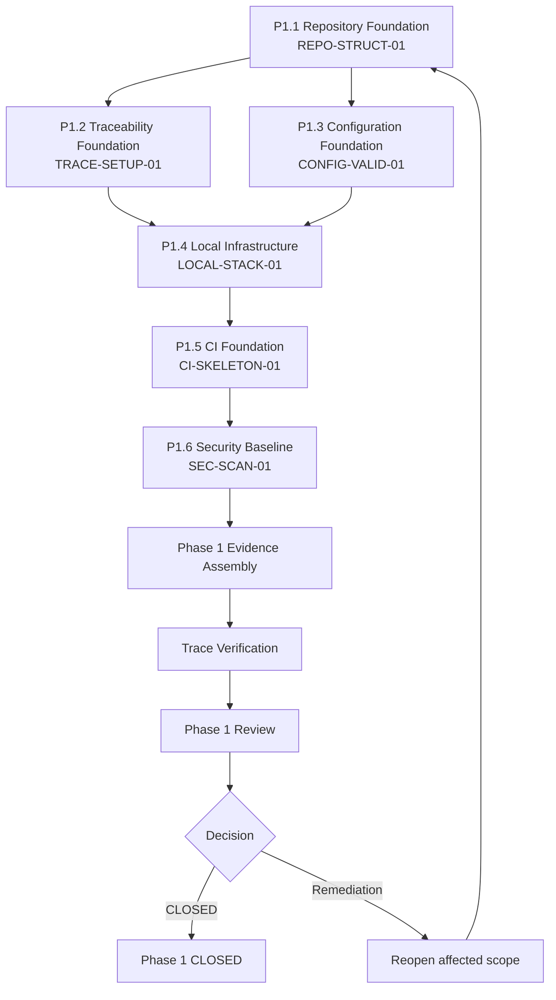

# SheetViz — Phase 1 Execution Plan

**Version:** v1.1
**Date:** 9 September 2026
**Status:** Draft untuk Final Confirm
**Authorization:** AUTH-P1-001 (Phase 1 UNLOCKED, Phase 2–13 LOCKED)
**Baseline:** Architecture Part 1–6 FINAL / APPROVED; Master Plan v1.0 FINAL / APPROVED

**Changelog v1.1:** Menutup P1 sequencing/governance clarification: P1.6 Security Baseline tidak dapat berjalan paralel dengan P1.5 CI Foundation; P1.5 membangun CI framework capability, sedangkan P1.6 melakukan security-specific hardening/enforcement dan menghasilkan SEC-SCAN-01 evidence.

---

## 1. Purpose & Scope

Dokumen ini adalah execution plan konkret untuk **Phase 1 — Repository + Infrastructure Foundation**. Ia menerjemahkan AUTH-P1-001 scope dan expected exit evidence menjadi workstream terurut, technology/tooling boundary, development environment, configuration architecture, CI/IaC skeleton, security baseline, traceability mechanism, test/evidence strategy, work order, dan Definition of Ready per work item.

**In scope:** enam Trace ID Phase 1 (REPO-STRUCT-01, CI-SKELETON-01, CONFIG-VALID-01, TRACE-SETUP-01, LOCAL-STACK-01, SEC-SCAN-01) dan workstream P1.1–P1.6.

**Out of scope (explicit):** database schema/RLS/audit privilege enforcement, auth/tenant implementation, domain lifecycle, Google integration, `_Meta` engine, sync engine, entitlement engine, API business implementation, frontend application, production deployment.

---

## 2. Workstreams & Dependency Order

**Mandatory dependency sequence:** `P1.1 → (P1.2 + P1.3 in parallel) → P1.4 → P1.5 → P1.6 → Evidence → Trace Verification → Phase Review`. P1.6 **must not** start until P1.5 CI Foundation is complete and its CI jobs can execute/report baseline results.

**Work order rationale:** Repository foundation harus stabil sebelum traceability/CI/configuration dibangun di atasnya. P1.2 dan P1.3 dapat berjalan paralel sesudah P1.1. Local stack bergantung pada traceability/configuration readiness. P1.5 menciptakan CI capability; P1.6 kemudian mengaktifkan security-specific scan enforcement di atas CI capability tersebut.

---

## 3. Workstream Details

### P1.1 — Repository Foundation (REPO-STRUCT-01)

**Goal:** Monorepo layout dengan ownership boundary yang jelas, branch protection, CODEOWNERS, dan PR/issue governance.

**Execution prerequisite (must be decided before P1.1 start):**

| Item | Required decision/evidence |
|---|---|
| Repository provider | GitHub, GitLab, atau Bitbucket (pilih provider yang tersedia/diizinkan) |
| Repository URL/path | Exact organization/project repository location |
| Protected branch | Exact primary protected branch name (default proposal: `main`) |
| Initial owner roles | Backend, Worker, Frontend, Infra, Security, Architecture/Implementation Docs reviewers |

P1.1 tidak boleh mulai sampai provider, repository URL/path, dan protected-branch target ditetapkan. Ini execution prerequisite, bukan perubahan architecture baseline.

**Deliverables:**

- [ ] Repository root dengan struktur: `backend/`, `worker/`, `frontend/`, `shared/`, `infra/`, `docs/`, plus `README.md`.
- [ ] `README.md` Phase 1: tujuan repository, cara menjalankan local stack (placeholder), status Phase 1.
- [ ] Branch protection rule: protected primary branch, required status checks (setelah P1.5/P1.6 tersedia), required pull request review (minimal 1 approver), no direct push tanpa approval.
- [ ] `CODEOWNERS` file: mapping path critical (backend/**, worker/**, frontend/**, infra/**, docs/architecture/**, docs/implementation/**) ke owner team/role.
- [ ] PR template: menyertakan field Trace ID, baseline reference, change classification (`implements`/`test-only`/`refactor-no-contract-change`/`requires-change-control`), checklist evidence.
- [ ] Issue template: field Trace ID, type (feature/test/infrastructure/security/migration/governance), linked baseline section.

**Technology/tooling boundary:**

- Git repository (GitHub/GitLab/Bitbucket — provider tidak mengubah architecture baseline; pilih yang sudah tersedia/diizinkan).
- Branch protection dan CODEOWNERS adalah fitur repository management, bukan implementation detail.

**Definition of Ready:**

- Authorization AUTH-P1-001 tersedia dan dipahami.
- Tidak ada conflict dengan baseline Part 1–6 atau Master Plan v1.0.
- Repository provider, URL/path, primary protected branch, dan initial owner roles telah ditetapkan.

**Expected evidence:**

- Repository URL/path.
- Screenshot/export branch protection rule.
- `CODEOWNERS` file content.
- PR/issue template content.
- Commit hash awal (repository foundation commit).

**Trace ID status transition:** `Planned → In Progress → Implemented → Verified` (setelah evidence direview dan branch protection/ownership terkonfirmasi).

---

### P1.2 — Traceability Foundation (TRACE-SETUP-01)

**Goal:** Traceability matrix hidup dan enforcement PR/issue linkage.

**Deliverables:**

- [ ] `docs/implementation/traceability-matrix.md` (atau `.csv`/spreadsheet ter-version) dengan kolom: Trace ID, architecture requirement, DB/contract anchor, planned service/module, API/worker/frontend surface, required test evidence, status (`Planned`/`In Progress`/`Implemented`/`Verified`/`Accepted`), implementation ID (repository path/PR/commit).
- [ ] PR template field Trace ID wajib diisi; CI check menolak PR tanpa Trace ID valid.
- [ ] Issue template field Trace ID dan baseline reference wajib.
- [ ] Initial traceability snapshot: semua Trace ID Phase 1 status `Planned`.

**Technology/tooling boundary:**

- Traceability matrix dapat berupa Markdown/CSV di repository atau spreadsheet ter-version di `docs/`. Yang penting versioned dan dapat di-link dari PR/issue.
- CI check Trace ID dapat berupa script sederhana yang parse PR description/body.

**Definition of Ready:**

- P1.1 repository foundation selesai (struktur + PR/issue template ada).
- Trace ID Phase 1 sudah ditetapkan (AUTH-P1-001 Section 3).

**Expected evidence:**

- Traceability matrix file content (initial snapshot).
- CI check script/content yang memvalidasi Trace ID presence.
- Contoh PR/issue yang passing Trace ID validation.

**Trace ID status transition:** `Planned → In Progress → Implemented → Verified` (setelah CI check berjalan dan traceability matrix dapat di-update dengan implementation ID).

---

### P1.3 — Configuration Foundation (CONFIG-VALID-01)

**Goal:** Typed configuration bootstrap dengan environment separation, secret injection pattern, dan fail-safe pada missing config.

**Deliverables:**

- [ ] Configuration module di `backend/app/config/` (atau path equivalent) yang:
  - Mendefinisikan typed config class/schema (pydantic/dataclass/typed dict — implementasi detail, yang penting typed dan validated).
  - Memisahkan environment config (local/dev/staging/production) via environment variable naming convention (mis. `APP_ENV`, `APP_DATABASE_URL`, `APP_REDIS_URL`).
  - Gagal aman (raise error) pada missing required config, bukan fallback silent.
  - Tidak menyimpan secret value dalam repository/history/build artifact.
- [ ] Environment variable documentation (`docs/implementation/configuration.md`): required env vars per environment, secret injection pattern (via environment/secret manager, bukan file committed).
- [ ] Config validation command/script (mis. `python -m app.config.validate`) yang dapat dijalankan CI/local untuk memverifikasi config availability/type.

**Technology/tooling boundary:**

- Python typed config (pydantic/attrs/dataclass) — pilihan implementasi detail, tidak mengubah baseline.
- Environment variable pattern: `APP_<SERVICE>_<VAR>` untuk namespace clarity.

**Definition of Ready:**

- P1.1 repository foundation selesai.
- Tidak ada OID yang perlu difinalisasi untuk config abstraction (config tetap netral terhadap provider).

**Expected evidence:**

- Config module code path.
- Config validation command output (local/CI).
- Documentation content.
- CI job yang menjalankan config validation.

**Trace ID status transition:** `Planned → In Progress → Implemented → Verified` (setelah config validation passing di CI dan documentation tersedia).

---

### P1.4 — Local Infrastructure (LOCAL-STACK-01)

**Goal:** Reproducible local/dev environment dengan PostgreSQL, Redis, API, dan worker test environment.

**Deliverables:**

- [ ] Docker Compose (atau script equivalent) yang menjalankan:
  - PostgreSQL (version sesuai baseline, mis. 15/16 — detail version tidak mengubah architecture).
  - Redis (version sesuai baseline, mis. 7).
  - API service (FastAPI skeleton, config-loaded, health endpoint).
  - Worker service (Celery skeleton, config-loaded, health endpoint).
- [ ] `docker-compose.yml` (atau script equivalent) dengan:
  - Network isolation (services dalam network yang sama).
  - Volume untuk data persistence (optional untuk dev).
  - Environment variable injection dari `.env` file (yang tidak di-commit) atau environment host.
  - Health check untuk setiap service.
- [ ] `README.md` update: cara menjalankan `docker compose up` (atau equivalent), health endpoint URL, troubleshooting dasar.
- [ ] API skeleton: `/health` endpoint yang mengembalikan status service, config environment (redacted), dan request ID (jika middleware sudah ada).
- [ ] Worker skeleton: task runner yang dapat dijalankan, minimal task health check (mis. task ping yang log ke stdout).

**Technology/tooling boundary:**

- Docker Compose untuk reproducibility (alternatif: script `make`/`just` yang menjalankan PostgreSQL/Redis/API/worker secara native — yang penting reproducible dan documented).
- PostgreSQL/Redis version mengikuti availability environment; tidak perlu final production version untuk Phase 1.

**Definition of Ready:**

- P1.1 repository foundation selesai.
- P1.2 traceability foundation dan P1.3 configuration foundation selesai.

**Expected evidence:**

- `docker-compose.yml` (atau script equivalent) content.
- Health endpoint response screenshot/output.
- CI job yang menjalankan stack (optional untuk Phase 1, tetapi recommended).
- README update content.

**Trace ID status transition:** `Planned → In Progress → Implemented → Verified` (setelah stack dapat dijalankan reproducible dan health check passing).

---

### P1.5 — CI Foundation (CI-SKELETON-01)

**Goal:** Membangun **framework/pipeline capability** CI yang dapat menjalankan dan melaporkan baseline validation jobs. P1.5 menyediakan capability; ia **belum** menyelesaikan security hardening/enforcement SEC-SCAN-01.

#### P1.5 Ownership Boundary: CI Capability Only

P1.5 bertanggung jawab untuk memastikan CI jobs ada, dapat dieksekusi pada PR/branch, dan menghasilkan basic report/status. Secret/dependency scan jobs dapat dibuat sebagai **non-blocking/bootstrap jobs** di P1.5 untuk memverifikasi wiring/tool invocation, tetapi history scan coverage, severity threshold, failure enforcement, required security status checks, remediation governance, dan security evidence menjadi tanggung jawab eksklusif P1.6.

**Deliverables:**

- [ ] CI configuration file (`.github/workflows/ci.yml` atau equivalent) dengan stages/jobs:
  - **Lint/Format:** menjalankan linter (ruff/flake8/black/isort untuk Python; eslint/prettier untuk TypeScript jika ada) dan formatter check.
  - **Basic Test:** menjalankan test matrix stub (pytest untuk Python backend/worker; jest/vitest untuk frontend jika ada) — test dapat berupa placeholder passing.
  - **Config Validation:** menjalankan command validation P1.3.
  - **Migration Validation Stub:** menjalankan Alembic `check` command (memvalidasi migration script dapat di-load, tanpa apply ke production).
  - **API Contract Diff Stub:** menjalankan script yang membandingkan `shared/api-contract/` baseline fixture dengan current (dapat berupa placeholder diff yang selalu passing untuk Phase 1).
  - **IaC/Security Review Stub:** menjalankan validation IaC skeleton (mis. `terraform validate` jika menggunakan Terraform, atau check struktur `infra/` directory).
  - **Security Scan Bootstrap (non-blocking):** invoke secret/dependency scan tool untuk membuktikan CI wiring; enforcement/cakupan final berada di P1.6.
- [ ] CI status badge (optional) di `README.md`.
- [ ] CI log output yang menunjukkan semua required P1.5 jobs dapat berjalan dan menghasilkan report/status.

**Technology/tooling boundary:**

- CI provider (GitHub Actions/GitLab CI/Bitbucket Pipelines) — pilih yang tersedia; tidak mengubah baseline.
- Tooling lint/scan/test sesuai stack (Python: pytest/ruff/black; TypeScript: jest/eslint/prettier).

**Definition of Ready:**

- P1.1 repository foundation selesai.
- P1.2 traceability foundation selesai (PR template Trace ID enforcement dapat diintegrasikan dengan CI).
- P1.3 configuration foundation selesai.
- P1.4 local infrastructure tersedia (CI dapat menjalankan stack untuk test integration stub jika diperlukan).

**Expected evidence:**

- CI configuration file content.
- CI run log/output: lint, test, config validation, migration/API-contract/IaC stubs, dan bootstrap security scan berhasil execute/report.
- Badge/screenshot CI status.
- Traceability update: CI job linked ke TRACE-SETUP-01 dan CI-SKELETON-01.

**Trace ID status transition:** `Planned → In Progress → Implemented → Verified` (setelah CI pipeline capability passing dan evidence terdokumentasi). `SEC-SCAN-01` tetap belum `Verified` pada P1.5.

---

### P1.6 — Security Baseline (SEC-SCAN-01)

**Goal:** Melakukan **security-specific hardening + enforcement** pada CI/branch governance yang disediakan P1.5. P1.6 adalah owner untuk security scan configuration correctness, history coverage, fail thresholds, mandatory security checks, remediation documentation, dan security evidence.

#### P1.6 Ownership Boundary: Security Hardening & Enforcement

| Area | P1.5 — CI Foundation | P1.6 — Security Baseline |
|---|---|---|
| CI job existence | Membuat/menjalankan framework job | Mengonfirmasi job security menjadi control wajib |
| Scan invocation | Bootstrap/non-blocking untuk prove wiring | Konfigurasi production-quality coverage dan enforcement |
| Secret scan | Tool can execute/report | Full repository history coverage; fail on finding; remediation evidence |
| Dependency scan | Tool can execute/report | Severity threshold (minimum high/critical); fail policy; remediation evidence |
| Branch protection | Base protection/pull request policy | Tambahkan security scan sebagai required status check |
| Documentation | CI use overview | Security baseline/remediation/escalation procedure |
| Trace ownership | `CI-SKELETON-01` | `SEC-SCAN-01` |

**Deliverables:**

- [ ] Secret scanning terintegrasi CI (gitleaks/trufflehog/GitHub secret scanning) dengan:
  - Scan repository history (bukan hanya current commit).
  - Fail CI jika secret terdeteksi.
  - Dokumentasi remediasi (rotate secret, remove dari history, update CI).
- [ ] Dependency scanning terintegrasi CI (pip-audit/safety/npm audit) dengan:
  - Scan dependency tree.
  - Fail CI pada high/critical vulnerability (configurable threshold).
  - Dokumentasi remediasi (upgrade dependency, pin version, apply patch).
- [ ] Branch protection rule update: required status checks termasuk secret scan dan dependency scan.
- [ ] Security baseline documentation (`docs/implementation/security-baseline.md`): cara menambahkan secret baru (via secret manager, bukan commit), cara remediasi secret/dependency issue, escalation path.

**Technology/tooling boundary:**

- Secret/dependency scanning tool sesuai CI provider (GitHub secret scanning/gitleaks/trufflehog; pip-audit/safety/npm audit).
- Threshold vulnerability (high/critical) untuk fail CI — dapat disesuaikan via configuration.

**Definition of Ready:**

- **P1.5 CI Foundation selesai dan Verified:** CI capability dapat menjalankan/report bootstrap jobs.
- P1.1 branch protection rule tersedia untuk di-update dengan required status checks.

**Expected evidence:**

- Secret scan CI job output (passing, full history scan, no secret detected).
- Dependency scan CI job output (passing, policy threshold documented, no unresolved high/critical vulnerability).
- Branch protection rule update screenshot/export yang menunjukkan security jobs required.
- Security baseline documentation content.
- Remediation drill/example (mis. intentionally seeded test secret marker yang terdeteksi lalu dihapus dari test branch, tanpa memasukkan secret nyata ke repository) atau equivalent verification evidence.

**Trace ID status transition:** `Planned → In Progress → Implemented → Verified` hanya setelah scan coverage/enforcement/branch requirement/documentation/evidence semua lulus.

---

## 4. Test & Evidence Strategy

### Evidence model per Trace ID

| Trace ID | Implementation evidence | Verification evidence | Status transition |
|---|---|---|---|
| REPO-STRUCT-01 | Repository path, `CODEOWNERS`, branch protection config, PR/issue template | Structure verification (manual/automated), PR/issue creation test | `Planned → Implemented → Verified` |
| TRACE-SETUP-01 | Traceability matrix file, CI Trace ID check script | CI run log (Trace ID validation passing), matrix update example | `Planned → Implemented → Verified` |
| CONFIG-VALID-01 | Config module code, validation command, documentation | Config validation CI job output, missing config fail test | `Planned → Implemented → Verified` |
| LOCAL-STACK-01 | `docker-compose.yml` (atau script), health endpoint code | Stack run log, health check response, CI integration (optional) | `Planned → Implemented → Verified` |
| CI-SKELETON-01 | CI configuration file, job scripts, bootstrap scan wiring | CI run log: P1.5 capability jobs execute/report | `Planned → Implemented → Verified` |
| SEC-SCAN-01 | Security scan policy/config, branch protection security checks, remediation doc | Full-history secret scan + dependency threshold result + enforcement/branch evidence | `Planned → Implemented → Verified` |

### Verification principles

- **Implemented ≠ Verified:** status hanya naik ke `Verified` setelah evidence direview dan passing test/verification.
- **Evidence-linked:** setiap status update harus melampirkan evidence (file path, CI run URL, screenshot, log output).
- **Reproducible:** evidence harus dapat direproduksi (CI run dapat di-rerun, stack dapat dijalankan ulang, config validation dapat di-verify).
- **Security ownership:** bootstrap job execution di P1.5 bukan evidence final untuk `SEC-SCAN-01`; SEC-SCAN-01 hanya dapat Verified oleh P1.6 setelah hardening/enforcement selesai.

---

## 5. Work Order & Sequencing

**Mandatory sequence:**

1. **P1.1 Repository Foundation** — stabilkan struktur dan governance.
2. **P1.2 Traceability Foundation** dan **P1.3 Configuration Foundation** — boleh berjalan paralel setelah P1.1 selesai.
3. **P1.4 Local Infrastructure** — dimulai setelah P1.2 dan P1.3 selesai.
4. **P1.5 CI Foundation** — membangun CI framework capability setelah P1.4 selesai.
5. **P1.6 Security Baseline** — dimulai hanya setelah P1.5 selesai dan verified; harden/enforce security scans.
6. **Phase 1 Evidence Assembly** — kumpulkan semua evidence, update traceability matrix.
7. **Trace Verification** — review semua Trace ID status, pastikan minimal subset `Verified` dan semua scoped requirements memiliki evidence yang diwajibkan authorization.
8. **Phase 1 Review** — formal review dengan evidence, decision CLOSED atau remediation.

**Only permitted parallelism:** P1.2 dan P1.3 dapat berjalan paralel setelah P1.1. P1.5 dan P1.6 **tidak dapat** berjalan paralel; P1.6 bergantung pada P1.5 selesai/Verified.

---

## 6. Risks & Mitigations

| Risk | Likelihood | Impact | Mitigation | Owner |
|---|---|---|---|---|
| Secret leakage (accidental commit) | Medium | High | P1.5 bootstrap scan → P1.6 required history scan/fail enforcement, branch protection, remediation/rotation procedure | Security/Backend |
| CI flakiness (false failure) | Medium | Medium | Retry logic, isolate flaky job, document known issue, fix root cause; never silently disable required security checks | Backend/Infra |
| Environment drift (local vs CI) | Medium | Medium | Reproducible Docker Compose, config validation, document environment variable requirement | Backend/Infra |
| Traceability enforcement bypass | Low | High | CI check mandatory, branch protection required status, review checklist | Governance/QA |
| Scope creep (Phase 2+ work) | Medium | High | Authorization reminder, PR change classification, reviewer enforcement | All |
| Security job appears present but is non-enforcing | Medium | High | P1.5 boundary + P1.6 verification requires full history coverage, failure threshold, required branch check, evidence | Security/Infra |

---

## 7. Definition of Ready per Work Item

Setiap work item (P1.1–P1.6) wajib memiliki:

- [ ] Trace ID linked (dari AUTH-P1-001 Section 3).
- [ ] Baseline reference (Part 1–6 + Master Plan v1.0 section yang relevan).
- [ ] Deliverables checklist (seperti di Section 3).
- [ ] Technology/tooling boundary (implementasi detail tidak mengubah baseline).
- [ ] Definition of Ready (prerequisite workstream selesai).
- [ ] Expected evidence (artifact yang akan di-link ke traceability matrix).
- [ ] Owner assigned (Backend/Infra/Security/Governance).
- [ ] Execution prerequisite P1.1 dipenuhi: provider, repository URL/path, dan protected branch ditetapkan.

---

## 8. Next Step — Final Confirm Gate

Setelah Anda review execution plan v1.1 ini, konfirmasi dengan:

- **APPROVE:** Phase 1 — Implement dapat dimulai sesuai mandatory work order dan Definition of Ready.
- **APPROVE WITH CHANGES:** berikan perubahan spesifik yang diperlukan sebelum implementasi.
- **REJECT:** berikan alasan dan blocker yang perlu diselesaikan ulang di Analyze/Plan.

Setelah approval, saya akan mulai **Phase 1 — Implement** dengan sequence wajib P1.1 → (P1.2 + P1.3) → P1.4 → P1.5 → P1.6, update traceability matrix real-time, dan kumpulkan evidence untuk Phase 1 Review.